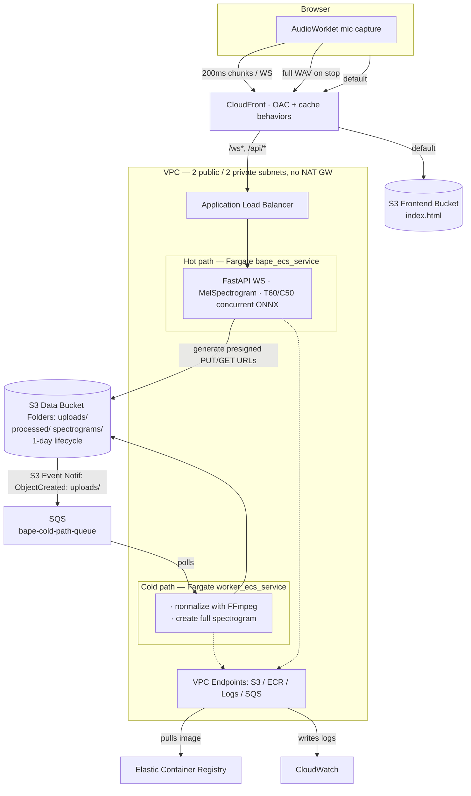

# Deploying BAPE (Blind Acoustic Parameter Estimator), an Acoustic ML Model, from Laptop to Real-Time Cloud Service

*An end-to-end AWS deployment portfolio: taking a research PyTorch model and evolving its infrastructure through **seven iterative stages** — from a local ONNX script to a distributed, real-time inference service on ECS Fargate with an async, queue-driven processing path.*


---
> Work in progress (Aug 2026): 
> - consolidating branches, tagging phase milestones and writing/finishing documentation 
> - live demo currently offline to save on infra costs; stack is reproducible from Terraform code
> - finishing demoes and instructions on how to reproduce
---

## Why this project

As a career-changer targeting **AWS Cloud / DevOps Engineering** roles I took the chance to deploy one real workload seven different ways, each stage solving the shortcomings of the last. The result is a documented decision trail showing *how* and
*why* an architecture matures.

Each `phase-N-*/` directory is a **self-contained snapshot** of the architecture at that stage
(its own IaC, dependencies, and decision log).

## What it does (Final deployment)

You speak into your browser microphone. The service streams your audio to a cloud inference backend and returns, in real time, an estimate of the room's acoustic character — **T60 reverberation time** and **C50 clarity** across 7 frequency bands — rendered as live charts and a spectrogram. When you stop, the full recording is processed asynchronously for a higher-resolution result.

The ML model itself is a given. **What this repo is about is everything around it**: the AWS architecture, Infrastructure-as-Code, container orchestration, security, cost control, and CI/CD that turn a research script into a service.

---

## Current architecture (Phase 7)

The production stage splits inference into a latency-sensitive **hot path** and a decoupled, CPU-heavy **cold path**, so real-time WebSocket sessions are never starved by full-recording processing.



**Hot path:** User starts recording using microphone → `AudioWorklet` is created and captures audio stream → 200 ms binary chunks are streamed over WebSocket and cached in an `offlineAudioBuffer` → another rolling 4 second buffer (required input length of onnx model) is created, filled and forwarded → a spectrogram is calculated using the `MelSpectrogram` class from `librosa` → spectrogram data is fed into T60 & C50 ONNX sessions, which run **concurrently** (`asyncio.gather`) every 200ms (→ rolling buffer is cut off by last 200ms to make space for new input) → JSON streamed back permanently for live D3 charts until user stops recording (→ triggering cold path processing)

**Cold path:** On stop, the browser encodes data from `offlineAudioBuffer` to WAV client-side to take load off of backend → queries API of main container to get **presigned S3 URLs** → uploads entire audio **directly to S3** (bypassing the API) → an S3 event notification `ObjectCreated` event is sent to **SQS** → a dedicated Fargate worker container polls the queue → worker normalizes with FFmpeg, regenerates a full-resolution spectrogram, and writes files to S3 → client polls presigned URLs from which the processed files become available → when available, results are downloaded from S3, rendered to frontend → *if* successful, the event notification is deleted from the SQS queue.

---

## The seven stages

The project evolved over 7 stages to its latest design.

| # | Stage | Problem it solves | Key (AWS) skills |
|---|---|---|---|
| **1** | Local ONNX deployment | make the model available locally for inference, either via CLI or FastAPI wrapper | ONNX Runtime, FastAPI, packaging |
| **2** | Naive cloud deployment | make the model available in the cloud | EC2, security groups, SSH, FFmpeg/librosa |
| **3** | Production-ready networking | make the model available at scale and securely | **VPC design, ALB, NATGW, HA across AZs**; also the ONNX export of the real BAPE model (was working with dummy model until here) |
| **4** | Serverless | Make the model available in the cloud with minimal maintenance overhead and zero idle costs | **Lambda** container image, ECR, CloudFront/S3 split, presigned URLs |
| **5** | Container orchestration | Make model available as a containerized application, reducing environment maintenance | **ECS Fargate + Terraform**, remote state, OIDC CI/CD GitHub Actions |
| **6** | Production real-time | Make model available in real-time | **WebSockets** on ALB/CloudFront, Web Audio API, right-sizing |
| **7** | Distributed hot/cold path | separate workload of real-time inference and post-processing to separate containers to improve performance  | **SQS**-driven async worker, second Fargate service, S3 events |

Each stage's `docs/` holds a first-person decision log explaining the trade-offs.

---

## Capability map — where each skill is implemented

This is a reading guide, not a résumé: each row points to the phase where the capability is
actually built, so you can jump straight to the code and its decision log.

| Capability | How it shows up here | Go to |
|---|---|---|
| **VPC networking** | 2 public / 2 private subnets across 2 AZs, IGW, NAT GW, then a NAT-free redesign using VPC endpoints | Phase 3 → 5–7 |
| **Compute options** | Same workload on EC2, then Lambda (container image), then ECS Fargate — a deliberate compute-model comparison | Phase 2 · 4 · 5–7 |
| **Edge & delivery** | CloudFront over a private S3 origin (OAC), with dedicated cache behaviors routing `/ws*` and `/api/*` to the ALB | Phase 4–7 |
| **Async / messaging** | S3 `ObjectCreated` → SQS → a separate Fargate worker, decoupling batch work from real-time | Phase 7 |
| **Infrastructure as Code** | Terraform with remote S3 state + native locking; later split into `persistent` vs `compute` modules | Phase 5–7 |
| **IAM & security** | Resource-scoped least-privilege policies, GitHub OIDC federation (zero static keys), private subnets, OAC | Phase 3–7 |
| **CI/CD** | GitHub Actions → ECR → ECS force-deploy, OIDC-authenticated and branch-locked per phase | Phase 5–7 |
| **Cost & privacy engineering** | NAT-free VPC endpoints, `PriceClass_100` CDN, and a 24h S3 lifecycle expiry (see below) | Phase 3–7 |

### No database was a deliberate design choice: 

This project intentionally has **no data tier**. The workload processes user microphone audio and estimates the spatial characteristics of the record surroundings, so **privacy is a hard requirement**: recordings are expired within 24 hours by an S3 lifecycle policy and nothing is persisted beyond that window. 
Adding a database would have meant storing personal audio data I have no reason to keep. Choosing a **stateless, zero-retention architecture** is the more defensible engineering decision here — privacy-by-design over a checkbox.

---

## Repository layout

```
phase-1-local_deployment/        # ONNX runtime, CLI + FastAPI
phase-2-manual_cloud_deployment/ # click-ops EC2
phase-3-proper-infra/            # custom VPC, ALB, private subnets + BAPE→ONNX export
phase-4-serverless_deployment/   # Lambda container image
phase-5-container-orchestration/ # ECS Fargate + Terraform
phase-6-production-ready/        # WebSocket real-time inference
phase-7/                         # distributed hot-path + cold-path (current)
```

Infrastructure for phases 5–7 is defined in each phase's `terraform/` directory; deployment is
automated via GitHub Actions (`.github/workflows/deploy-phase{5,6,7}.yml`).

---

## Highlighted engineering decisions

- **NAT-free private egress** — private subnets reach S3/ECR/CloudWatch/SQS via VPC endpoints
  instead of a NAT Gateway, removing a significant fixed monthly cost.
- **GitHub OIDC over static credentials** — CI/CD assumes a branch-locked IAM role via OIDC
  federation; no long-lived AWS keys stored in GitHub.
- **Presigned-URL claim-check pattern** — large audio bypasses the API server, uploading straight
  to S3 to keep the request path light.
- **Privacy-by-design** — a 24-hour S3 lifecycle expiry means user recordings are never retained.
- **Hot/cold decoupling via SQS** — CPU-spiky batch work runs on its own Fargate service so it
  can't degrade live WebSocket latency.

---

## Status & roadmap

Phase 7 is the most advanced architecture and is **deployable end-to-end via the included
Terraform + CI/CD**. To keep costs at zero between demos, the cloud stack is **not kept
permanently running** — it is stood up from IaC on demand. Phases 1–6 are preserved as
historical snapshots of the architecture at each stage.

This repo is under active polish toward a portfolio-ready state. Planned next:

- **Per-phase architecture diagrams** (Mermaid, rendered inline) — in progress
- **Per-phase decision logs** distilled from the development record - in progress
- [ ] **A demo for each phase** — reproducible IaC where practical, annotated screenshots / a
      short screen recording at minimum
- [ ] A one-command teardown/standup note per phase for cost-safe reproduction
