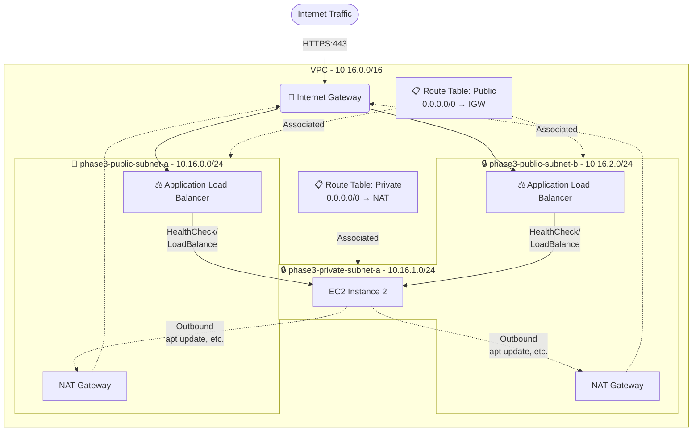

# Building an ML-OPs pipeline in different stages of elaboration for the BAPE Project

## **Status:** 🚧 Active Development (Phase 3: Security & Networking)

### Current Objective
Transitioning from a manual EC2 deployment (Phase 2) to a scripted, secure VPC architecture using AWS CLI.

### Architecture State
- [x] Custom VPC Design (10.16.0.0/16)
- [x] Public/Private Subnet Isolation
- [x] NAT Gateway implementation for private outbound traffic
- [ ] Application Load Balancer (In Progress - blocked on SSL config)
- [ ] HTTPS/Microphone Secure Context (Upcoming)

### Key Documentation
* currently in local development, commit to public repo is next 

---

## General project information (tbc)

### Problem:
Scaling out the inference architecture for a Fraunhofer-backed research model in incremental stages, transforming a local Python script into a globally accessible, cost-optimized Serverless API. 

Stages:

1. local onnx deployment
2. manual cloud deployment: deployed on EC2 instance, security groups, SSH instance access
3. proper cloud deployment
4. IaC/Serverless
5. Containerize?
6. Advanced output, analytics, logging, visualization

### **Phase 1: Local deployment with onnx runtime**
- local deployment
- CLI app and FastAPI endpoint

### **Phase 2: Naive Cloud Deployment**
- manually configured, click-Ops EC2 instance
- configured AL2023 server to run FFmpeg as prebuilt app
- updated `audio_processor.py` to use `librosa` instead of `soundfile`

### **Phase 3: Production-Ready Cloud Deployment**
*In this phase, the goal was to transition from the naive manual deployment of Phase 2 to a scalable, secure, and maintainable cloud architecture. This involved designing a custom VPC, isolating services in private subnets, and managing ingress traffic with an Application Load Balancer.*

#### Phase 3 - Target Architecture

### **Phase 4: Serverless Lambda Deployment**
[TBD]

### **Phase 5: Containerized Deployment**
[TBD]

### **Phase 6: Real-Time Inference Deployment**
[TBD]

### **Phase 7: Distributed multi-model hot- and cold-path Deployment**
[TBD]

---
---

### *Detour: Integrating the real BAPE Model*

At the start of phase 3 I was invited to the GitHub repo of the real world PyTorch model we are deploying in this project and were substituting with a dummy model until here. 
This required a deep dive into the BAPE repository`s "code archaeology" to reverse-engineer the model's architecture and data preprocessing requirements from a complex, unfamiliar codebase.

**The process involved:**
- **Systematic Code Investigation:** Tracing Hydra `.yaml` configurations to identify the model's structure and dependencies.
- **Environment Debugging:** Resolving a `TimeoutError` by downgrading from an unsupported Python 3.13 environment to a stable 3.11 build.
- **Model Weight Surgery:** Writing a script to parse and rename keys in the pre-trained `.pth` file to match the reconstructed model architecture.
- **Tensor Shape Correction:** Diagnosing and fixing a 4D tensor shape mismatch required by the model's `Conv2d` layers.

The successful result was a self-contained `exporter.py` script that produces a validated `speech_encoder.onnx` model, ready for deployment.

**[➡️ The full, detailed story of the model export process in my Decision Log(Coming soon).](./docs/DECISION_LOG.md#x-embedding-bape)**

--> 2 Public Subnets for 2 ALB nodes (ALB HA) while having only 1 EC2 instance in 1 private subnet --> decision for dev purposes, doesn't make sense but is not possible cheaper (AWS requires HA for ALBs)

[ONNX model arch exported with Neutron.app]

Links to all phases (architectures, learnings)
