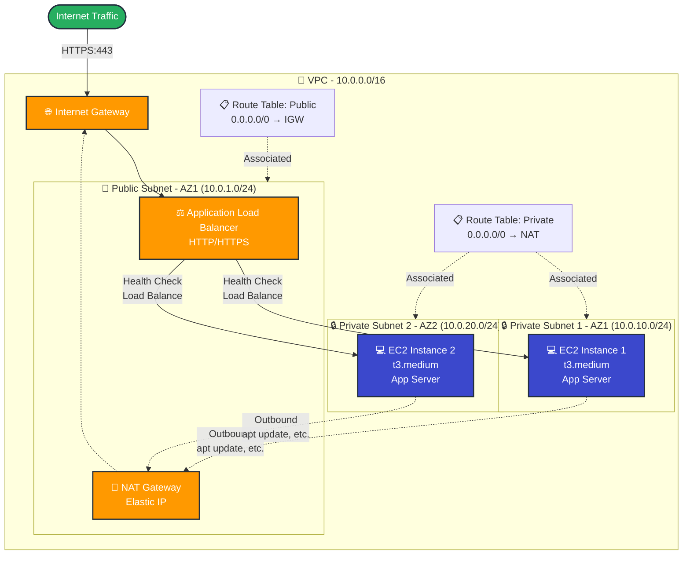

# Phase 3 – Proper (Standard?) Cloud Deployment – ONNX deployment evolution

## 0. Restructuring overall project in separate phase folders (Proper Cloud Deployment)

Before setting up the project folder for stage 3, I wanted to clean up the project structure and establish folders for each project stage, with their respective file versions at the end of each stage.

For this I displayed the versioneing tree with `git log --all --decorate --oneline --graph` and found out at which commits (`hashes`) Phase 1 and 2 ended.

I then created dedicated folders for phase 1 and 2.
As I learned from the versioning graph, the end of phase 1 was at commit `b5c9d1c` and I used `git archive …` to store this project state in the `phase-1-local_deployment` folder.

More specifically:
`git archive b5c9d1c | tar -x -C phase-1-local_deployment`

Explanation:
`git archive …`: This creates a new archive from all files of that specific commit.
`| tar`: Pipe to tar, which…
`-x -C phase-1-local_deployment`: istructs tar to extract (`-x`) the piped archive and change (`-C`) it to the `phase-1-…` folder.

As we are about to start with stage 3, we can still take a snap shot of our latest project version (`HEAD`) and store it to the stage 2 folder:
`git archive HEAD | tar -x -C phase-2-manual_cloud_deployment`

I then removed all files but README.md and .gitignore (`--cached` tells git to also remove them from tracking) from the root folder:
`git rm -r --cached api.py cli.py docs dummy_acoustic_model.onnx requirements.txt requirements-dev.txt src`

and deleted them for definitely, not only from tracking:

```zsh
rm -rf api.py cli.py dummy_acoustic_model.onnx requirements.txt requirements-dev.txt src temp docs
```

After running `tree -L 3` to check the project structure, I committed and merged the `refactor/project-structure` branch to main:

```zsh
git add .
git commit -m "refactor: Organized project folder(s) into self-contained snapshots of each phase within the bigger project"
git checkout main
git merge refactor/project-structure
git push origin main
# branch not yet deleted – command: git branch -d refactor/project-structure
```

## 1. Initializing Phase 3 and embedding BAPE (todo: translate to decision_log)

### 1.1. Switching to `feat/proper-AWS-deployment` branch and create phase 3 folder

On `main`, pull all changes.
Switch to `feat/proper-AWS-deployment` branch.

Create Phase 3 folder and decision log.

copy recursively:

- `phase-2-manual_cloud_deployment/api.py`
- `phase-2-manual_cloud_deployment/src/`
- `phase-2-manual_cloud_deployment/dummy_acoustic_model.onnx`
- `phase-2-manual_cloud_deployment/requirements*.txt`

to `phase-3-proper-infra/` .

I started the phase by committing the phase 3 folder to the new branch.

### 1.2. Introducing BAPE (Blind Acoustic Parameter Estimator)

*November 7 - 12* 

So far phase 1 and 2 were using a placeholder onnx model, at the start of phase 3 I got access to the project I was planning to deploy in the first place.

My collaborator shared the "BAPE" (Blind Acoustic Parameter Estimation) GitHub repository with me and a .pth-file of his model, which is a serialized file format used to save the state (weights) of a trained model. I will use this to export an onnx model which will be an essential artifact of our cloud deployment.

This part of the project required me to go beyond cloud engineering and tackle ML Ops.

**To Do:**

- link to onnx

- translate to decision_log:
  - investigating an unknown model, 
  - reverse-engineering its data requirements, 
  - writing an export script to convert it to a deployable format, and 
  - integrating it into a web service

**Thoughts before process:**

- The BAPE repository seems solely focussed on model training. #Why?
- What do I need to understand about the repository? What would a professional setting demand? What not?
- What would be my contribution in an ML deployment project? Where do I add value? For developers, executives,…?

My collaborator never deployed the model until now: I asked him 
- how this step would ideally support him, 
- what he would be able to learn from a deployment. 
  
The model produces various information, but the required/ideal output is undefined.
=> explore profiling, logging, graphing and monitoring opportunities

- the repository is set up in .py and .yaml files, I also see that the project uses Hydra which I never heard of
=> a short investigation made me understand that hydra is a configuration app for complex hierarchical projects, it uses yaml files to define (default) configurations for (Python) source code

**Rough plan for BAPE integration:**

1. Code archeology: Make sense of the project repository, find the `__main__` script and retrace it's processes and inputs.
2. Model export: Build an exporter script which builds the architectural shell (provided by the BAPE repository), loads `*.pth` file (model weights) and export the model as an `onnx`.
3. Audio preprocessing: The model takes in Melspectrograms (image graphs, which are always 4d tensors: batch, channels, height, width) as input, we will need to edit `audio_processor.py` to transform audio input into Melspectrograms and adapt the 4d shape.
4. Local testing on local FastAPI-wrapper / run `api.py`: Load model, run inference session, get results. 
5. With the new source code input, new dependencies will likely be introduced. 
`requirements.txt` will need updates/upgrades; important for the projects README
6. Learn about model outputs, improve resulting format and information.
7. *Continue to deploy asap*

### 1.3 Code archaeology: Making sense of the BAPE repository
After receiving the invite to the BAPE repo, I wanted to make myself familiar with the project structure and learn what I would need to change in my existing repo to deploy and run the BAPE model.

I was looking for: 
- the main model, 
- the preprocessing logic for model input and 
- the model's input shape requirements

Scanning the folder structure I learned that a `conf/` folder with `.yaml` files is the structure of a Hydra app, which is

> *an open-source Python framework that simplifies the development of research and other complex applications. The key feature is the ability to dynamically create a hierarchical configuration by composition and override it through config files and the command line. The name Hydra comes from its ability to run multiple similar jobs - much like a Hydra with multiple heads.*

The starting point for my search was the goal to find the main model training script. As Hydra uses `defaults` to define the default elements in complex hierarchical projects, it also defines a default `model`. In `conf/train_speech_encoder.yaml` I found the definition `model: speech_encoder`. 
This lead me to the model specific config file under `conf/model/speech_encoder.yaml`. It defines `_target_: src.model.speech_encoder.SpeechEncoder` and thereby gave me the path of the main (default) model under `src/model/speech_encoder.py`. In that file the `SpeechEncoder` class is defined and from its `forward` function I learned that the model takes one input only, `x: Tensor`:


```speech_encoder.py
# (…)
class SpeechEncoder(nn.Module):
    #(…)
    def forward(
        self, x: Tensor
    ) -> Tuple[Tensor, Tensor, Optional[Tensor], Optiona[Tensor]]:
#    (…)
```

Next, I needed to understand what exact input parameters are required, how the preprocessing pipeline functions.
Scanning the folder structure again, I saw that the project separates `data` and `data_gen` – it's not just loading data but needs to prepare/generate it for inference.

Again, looking at the main model training config, `conf/train_speech_encoder.yaml`, under `defaults:`, the default `data:` definition is `speech`, leading me to `conf/data/speech.yaml`. 
Tracing the `data:` key, I ws looking for specific input parameters like `sample_rate` but found that `speech.yaml` was instead referencing `pyd`-files, which, in the context `webdataset`  are arbitrary file extensions within a `.tar` archive. (The target of `conf/data/speech.yaml` is `DataModule` class, which is defined in the `src/data/datamodule.py` script and imports `webdataset`.) I understand `wetspec.pyd` as "a data blob that contains the wet spectrogram data." So I had to further trace where the pyd file came from.

From there I found `conf/datagen_speech.yaml`, which defines the input parameters for the `generate` function of `src/datagen/speech.py` as well as two complex input objects, `speech_representation`and `rir_representation`, including their `_target_` defined as `src.util.signals.MelSpectogram` and other parameters.
This information helped me understand that the main data input (as configured in `conf/train_speech_encoder.yaml`) are MelSpectograms as defined here.
MelSpectograms are a 2D representaion of audio signals. They are defined by their mel frequency bins, or `n_mels`, defining the spectograms height, here `16`, and their `trunc`, here `2000`, a definition of if and how the input is truncated, defining the width of the spectogram. This gave me the the understanding that the input shape is `[1, 16, 2000]` (batch size, height, width).
But as the the config of the main model, `conf/model/speech_encoder.yaml` configures the parameters for `SpeechEncoder` instances, it defines `front_end`, `sequence_model` and `error_model` as input objects with `cnn2d.CNNEncoder` and `seq.SequenceModel` as target classes. As `cnn2d.CNNEncoder` is a `Conv2d` layer it is designed to work on images, and images are always represented as 4D tensors (Batch, Channels, Height, Width). So for the input of the `generate` function the input tensor would need to have the shape `[1, 1, 16, 2000]` (bacth size is 1, channel is 1 because grayscale image, `n_mels`/height are 16 and the graph is truncated at 2000)

This gave me a rather clear challenge: Write a script that programmatically reconstructs the model's architecture by interpreting the Hydra configuration, loads the weights, and performs the ONNX export.

### 1.4. Model export

And so I retraced the process of training the model in order to understand the preprocessing and the export:

- A user runs the `train_speech_encoder` task. 

- Hydra, the config system loads `conf/train_speech_encoder.yaml`, which defines a default model, `speech_encoder`.
*`exporter.py` will need to import the `SpeechEncoder` class from `speech_encoder`.*

- This default model is configured in `conf/model/speech_encoder.yaml`, it targets the `SpeechEncoder` class of `src/model/speech_encoder` and provides 3 data objects, `frontend` (target is `CNNEncoder` class of `src/model/cnn2d`), `sequence_model`(target is `SequenceModel` class of `src/model/seq`) and `error_model` (target is `SequenceModel` class of `src/model/seq`).
*In order to rebuild the architecural shell of the `speech_encoder` model, `exporter.py` will need to import these dependencies (`cnn2d.py`, `seq.py`), , so we can instantiate their classes.*

- With the architectural shell in place, `exporter.py` must now imitate the data preprocessing logic of the `speech_encoder` model. Again the `train_speech_encoder.yaml` tells us that `speech` is the default data, so we look for further information in `conf/data/speech.yaml`. There I expected clear cut input parameters but instead found `pyd` files referenced as data input, meaning preprocessed data. So the model not just loads raw data, it preprocesses/generates it. 
- The data config `conf/data/speech.yaml` names a `DataModule` class instance as its target, and, tells us that it consumes data from urls where it expects `.pyd` files. These must be created and we find their recipes in `conf/datagen_speech.yaml`: 
This config file targets the `generate` function of `src/datagen/speech` and, besides clear parameters, provides config values for `speech_representation`, an instance of the `MelSpectogram` class, and another `MelSpectogram` instance called `rir_representation`, with its own config values.
*`exporter.py` must do the same and instantiate `MelSpectogram` as a preprocessor for data input. It also must generate a dummy audio signal. This will have the shape of (64000,) (4 sec * 16000 samples/sec)*
- *`exporter.py` then forwards the dummy input through the preprocessor which forms it to a Tensor of the shape `[16, 2000]` (height, width)*
*Next, it adds a bacth size dimension to the tensor at the first position (`.unsqueeze(0)`) giving the tensor a shape of `(1, 16, 2000)` (batch size, height, width)*
*As the CNNEncoder class is a Conv2d layer (`torch.nn.Conv2d()`) it expects 4 arguments (bacth size, channels, height width), so `exporter.py` must unsqueeze the tensor at position 1.*

- This finishes the preprocessing of the input: we have the architectural shell, the preprocessed dummy input and can now load the pth weights.

- `exporter.py` uses `torch.load()` to load the pth from path into a dictionary named `state_dict`.

- Next it uses the `load_state_dict()` function of the `SpeechEncoder`instance `model`to load the dictionary*

At this point the script was failing. The Traceback reported there are errors in loading `state_dict` for `SpeechEncoder` and was listing missing keys. At first glance one could see that almost all keys loaded in `state_dict` were beginning with `encoder.`. Those reported as missing had the same names without the starting `encoder.`

`exporter.py` was updated with additional instructions to 
- order the dict (`new_state_dict`)
- run through all entries, and if a key starts with the `encoder.` prefix
    - the key is redefined as the key minus the starting prefix

- `exporter.py` uses `model.load_state_dict(new_state_dict, strict= False) to load again. This time successfully.

After setting the model to evaluation mode, we instruct the ONNX export:

In the [`torch.onnx.export` documentation](https://docs.pytorch.org/docs/stable/onnx_export.html#torch.onnx.export) we find the required parameters for the export and we specify our export:
- we define model as `model`, our instance of `SpeechEncoder`
- give example positional inputs from the preprocessed `final_4d_tensor``
- defin the path, where to export the model
- we give more descriptive input and output names
- we define dynamic axes to enable dynamic batch sizes, so one or more input files


Running the `exporter.py` I had several issues. I learned about the shape requirements of Conv2d layers and when the onnx.export returned a TimeoutError immediately, I learned that my Python 3.13 version was too new and not yet supported by the torch library. So I saved my virtual environment closed and stored it, to create a new one with the more robust Python3.11 

---

### 1.5. Refactoring `audio_processor.py` to support the new model.

The onnx model we just exported expects a MelSpectogram input with a shape of `(1, 1, 16, 2000)`.
I have to update the `audio_processor.py` to support this requirement.

Copied `MelSpectrogram` class from `BAPE/src/util/signals.py`.
Instantiated it with config values from `conf/datagen_speech`'s `speech_representation` object.

### 1.6. Local testing on local FastAPI-wrapper / run `api.py`: Load model, run inference session, get results. 

TBD

### 1.7. Learn about model outputs, improve resulting format and information.

TBD

### 1.8. Cleanup for cloud deployment / requirements,… 
`requirements.txt` will need updates/upgrades; important for the projects README
Decided to use `pipreqs`. Had to weed out training and model export dependencies, like `hydra-core`, `datasets`or `lightning`.

### 1.9. Later edits
As I did not yet profile the memory usage of the `generate_vector()` function I installed the `memory_profiler` package and added `from memory_profiler import memory_usage` to profile the memory usage of the `generate_vector` function we run to get our results.

[2025-11-18] I learned that the speech encoder only produces a necessary input for the main model, ParameterEstimator.
As my friend only benefits from the final results of the ParameterEstimator, I refactored my code right away, but made a small addition: The ParameterEstimator returns outputs (estimated_params) and quantiles_adjusted but I wanted to make the SpeechEncoder results, the acoustic finger print, visible as well to deliver a more complete response. So, I created a new class (`SuperParameterEstimator`)in the updated exporter script which is very much the same as the `ParameterEstimator` but also returns `z`, the latent vector resulting from the speech encoder, as `latent_vector`.
I later on learned that the bape project does not only use an CNNEncoder model to encode speech but there is also a CNNDecoder which should be able to decode speech from `latent_vector`, the output of the speech encoder and input to the parameter estimator.

Refactoredto new files:
- `exporter.py` -> `param_estimator-onnx_exporter.py` (defines `SuperParameterEstimator` class, which takes in an `ParameterEstimator` instance and returns both the results of the SpeechEncoder and the ParameterEstimator. 
When this new `SuperParameterEstimator` architecture is built, instantiating all required models, it loads an updated pth file my friend also gave me to load into this arch, resulting in an instance called `param_estimator_model`. 
Then, just as before, a dummy audio tensor is generated and formated for model input which happens during the final `torch.onnx.export`, which also defines the three returning values `z, outputs and quantiles_adjusted` as `latent_vector`, `estimated_params` and `quantiles`. The export produces `super_param_estimator.onnx`)

- `api.py` was not renamed but updated to use the new `super_param_estimator.onnx` model, also the API response was updated for the new results

## 2. Actual cloud deployment.

### 2.1. Drafting of required resources

I set out to define what resources would be required:

- 1 VPC

- 1 IGW

- 4 Subnets in two AZs
    - 2 public for 2 NATGWs, 
    - 2 private for EC2 instances
    -> 1 private + 1 public per AZ

    *initially was*
    - 2 Subnets
        - 1 public for NAT Gateway
        - 1 private for EC2 instances
        - 2 RTs (1 per subnet)

As I was using Gemini to suggest an incremental learning path forward, it suggested deploying two ALB nodes in two public subnets in different AZs and in one of these AZs also a private subnet containing the EC2 instance.
After pushing several times against the idea of having only one target for the two ALB nodes (as described further up), the model was still sure about this increment making sense. To experience what is working and what is not I complied, and went for

- 3 Subnets in 2 AZs
    - 1 public subnet in each AZ, each containing a NATGW
    - 1 private subnet in one of the AZs
    - in each AZ there is an ALB node

- ELB / ALB
    - 1 ALB node in each AZ

- S3 bucket storing model
    - api.py calls onnx-model
    - IAM Role/ instance profile for instance accessing S3

### 2.2. CIDR-planning / IP-Ranges to avoid (TBD!)

- max CIDR is 10.0.0.0/16
- common ranges to avoid
    - 10.1.0.0/?
        10.1.0.0 – 10.15.0.0
    - 10.0.0.0/8:
        10.0.0.0 – 10.0.0.255
    - 169.254.0.0/16:
        169.254.0.0 – 169.254.255.255
    - 172.16.0.0/12
        172.16.0.0 - 172.32.255.255

#### First Proposal
- VPC CIDR: 10.16.0.0/16
    - Public Subnet 10.16.0.0/17: 10.16.0.0 – 10.16.127.255
    - Private Subnet 10.16.127.0/17: 10.16.128.255 - 10.16.255.255

This decision would be fine per se, but both subnets would have 32768 IP addresses, half of all addresses available, which makes future additions complicated or impossible.
Changing from /17 subnets to /24 subnet CIDR ranges, gives each subnet 256 addresses out of a 65,536 VPC CIDR range and seems much more reasonable so the decision was 
revised to:

- VPC CIDR: 10.16.0.0/16
    - Public Subnet 10.16.0.0/24: 10.16.0.0 – 10.16.0.255
    - Private Subnet 10.16.1.0/24: 10.16.1.0 - 10.16.1.255

As the amount of subnets is subject to change, it should be mentioned that this is most importantly about switiching from /17 ranges to /24 ranges.

Furthermore I sketched out first architecture diagrams in draw.io:

### 2.3. Architecture TBD!!

draw-io / Architecture images (placeholders) or mermaid?

---

![2AZx4SN-ALB+2NATGW+2EC2] ("Image-URL")
Moving too fast: I was immediately trying to build a resilient and highly available infra which will be necessary for production, but I'll iterate in smaller steps to get there.

---

[1AZx2SN-ALB+NATGW+2EC2] ("Image-URL")
Good practice but let's build this up step by step…

---


…, seems good now. But… 

With an Application Load Balancer however, it is a requirement that you enable at least two or more Availability Zones. This configuration helps ensure that the load balancer can continue to route traffic. If one Availability Zone becomes unavailable or has no healthy targets, the load balancer can route traffic to the healthy targets in another Availability Zone.
*From* [How Elastic Load Balancing works – Availability Zones and load balancer nodes](https://docs.aws.amazon.com/elasticloadbalancing/latest/userguide/how-elastic-load-balancing-works.html#availability-zones)

During the setup of the resource definitions I became more and more familiar with the resource requirements and it didn't take long to realize, I would need to create 
- a NAT Gateway in a public subnet and 
- an EC2 instance in a private subnet and 
- an ALB node in their common AZ.

This I would need to create twice in two distinct AZs for high availability and for the ALB nodes to have sufficient targets.


---
#### ***HOW DOES THIS FIT IN???***
***What is correct/wrong?***


---

This built the foundation for the cloud deployment described in the next chapter


The resulting resources were documented and described iteratively in the last chapter *X. Resources*. Iteratively because as resources were built IDs/identifiers became available for subsequent commands.
Also, resources causing costs were tore down at the end of sessions and rebuilt when I returned. Having the resources and their information properly documented was essential to keep pace. Nevertheless, it caused me a lot of work and it motivated me enormously to keep pushing in order to benefit from the automation of Infrastructure as Code, which is used in phase 4.

### 2.4. Cloud deployment via AWS CLI

First tries to define the VPC.

#### Log in via SSO Identity Center:

```zsh
aws sso login --profile dev
```

#### 2.4.1. Create resources

##### 2.4.1.1. VPC

```zsh
aws ec2 create-vpc \
--cidr-block 10.16.0.0/16 \
--tag-specifications "ResourceType=vpc,Tags=[{Key=Name,Value=phase3-vpc}]" \
--profile "dev" \
--region "eu-central-1"
```
-> retrieve VPC-ID

##### 2.4.1.2 .Subnets

```zsh
aws ec2 create-subnet \
--cidr-block 10.16.0.0/24 \
--tag-specifications "ResourceType=subnet,Tags=[{Key=Name,Value=phase3-public-subnet-a}]" \
--vpc-id # retrieve from 'X. Resources'\ 
--profile "dev" \
--region "eu-central-1" \
--availability-zone "eu-central-1a"

aws ec2 create-subnet \
--cidr-block 10.16.1.0/24 \
--tag-specifications "ResourceType=subnet,Tags=[{Key=Name,Value=phase3-public-subnet-b}]" \
--vpc-id # retrieve from 'X. Resources'\ 
--profile "dev" \
--region "eu-central-1" \
--availability-zone "eu-central-1b"

aws ec2 create-subnet \
--cidr-block 10.16.2.0/24 \
--tag-specifications "ResourceType=subnet,Tags=[{Key=Name,Value=phase3-private-subnet-a}]" \
--vpc-id # retrieve from 'X. Resources'\ 
--profile "dev" \
--region "eu-central-1"
--availability-zone "eu-central-1c"
```
After subnet creation I was able to retrieve the Subnet-IDs; documented in *X. Resources*

##### 2.4.1.3. Internet Gateway

```zsh
aws ec2 create-internet-gateway \
--tag-specifications "ResourceType=internet-gateway,Tags=[{Key=Name,Value=phase3-igw}]" \
--profile "dev" \
--region "eu-central-1"
```
After internet gateway creation I was able to retrieve the IGW-ID; documented in *X. Resources* 

###### Attaching the IGW to the VPC:
```zsh
aws ec2 attach-internet-gateway \
--internet-gateway-id # retrieve from 'X. Resources'\
--vpc-id # retrieve from 'X. Resources'\
--profile "dev" \
--region "eu-central-1"
```
With the VPC connected to the IGW / public internet, I was able to define route tables and thereby make traffic possible,

##### Public and private route tables
```zsh
aws ec2 create-route-table \
--tag-specifications "ResourceType=route-table,Tags=[{Key=Name,Value=phase3-public-route-table}]" \
--vpc-id # retrieve from 'X. Resources'\
--profile "dev" \
--region "eu-central-1"

aws ec2 create-route-table \
--tag-specifications "ResourceType=route-table,Tags=[{Key=Name,Value=phase3-private-route-able}]" \
--vpc-id # retrieve from 'X. Resources'\
--profile "dev" \
--region "eu-central-1"
```
##### Set up PUBLIC networking
Create public route table first so that route table ID can be retrieved to create routes.

```zsh
aws ec2 create-route \
--route-table-id # retrieve from 'X. Resources'\
--destination-cidr-block 0.0.0.0/0
--gateway-id # retrieve from 'X. Resources'\
--profile "dev" \
--region "eu-central-1"
```
associate public route table to public subnets

```zsh
aws ec2 associate-route-table \
--route-table-id # retrieve from 'X. Resources'\
--subnet-id # retrieve from 'X. Resources'\
--profile "dev" \
--region "eu-central-1"

aws ec2 associate-route-table \
--route-table-id # retrieve from 'X. Resources'\
--subnet-id # retrieve from 'X. Resources'\
--profile "dev" \
--region "eu-central-1"
```
– PUBLIC NETWORKING COMPLETE –

##### Set up PRIVATE networking

```zsh
aws ec2 associate-route-table \
--route-table-id # retrieve from 'X. Resources'\
--subnet-id # retrieve from 'X. Resources'\
--profile "dev" \
--region "eu-central-1"
```

#### Change of requirements

At this point the requiremnts for the app changed and were updated:

- real-time input via mic and real-time output of results as graph
- no microphone signal via the public internet
- find ways to make model access efficient
  - download model with mobile app?
  - download model into browser cache?

ONNX provides a *web* functionality allowing the browser to run input against the model without sending any user input or other data via the public internet. 
The possibility of our app leaking microphone signals of interested users would not be acceptable, and the privacy of the users must be guaranteed at any time.

#### …Resource Creation continued…

##### Creating the NAT-Gateway
```zsh
aws ec2 allocate-address \
--domain vpc \
--tag-specifications "ResourceType=elastic-ip, Tags=[{Key=Name,Value=phase3-eip}]" \
--profile "dev" # \
# --region "eu-central-1" already defined in profile

aws ec2 create-nat-gateway \
--subnet-id # retrieve from 'X. Resources' / Public Subnet A\
--allocation-id # retrieve from 'X. Resources' / phase3-eip \
--tag-specifications "ResourceType=internet-gateway,Tags=[{Key=Name,Value=phase3-natgw}]" \
--profile "dev"
```


Tell the private route table to send all traffic to the NAT Gateway
```zsh
aws ec2 create-route \
--route-table-id # retrieve from 'X. Resources' / phase3-private-table \
--destination-cidr-block 0.0.0.0/0 \
--gateway-id # retrieve from 'X. Resources' / phase3-natgw \
--profile dev
```

Now, the outbound engine is live and I need a place to store the model (`super_param_estimator.onnx`) and the BAPE submodule(?) in the cloud. From there, the EC2 instance will fetch them during boot.

##### Create an S3 bucket for storage

```zsh
aws s3 mb s3://onnx-deployment-phase3-artifacts-dgoossens-20250106 \
--profile dev
```

#### Prepare Artifacts

##### zip the BAPE submodule locally

```zsh
#from /phase-3-proper-infra
zip -r bape_src.zip src/BAPE_src
```

##### upload the onnx module and the zipped submodule to the S3 bucket
```zsh
aws s3 cp onnx/super_param_estimator.onnx \
s3://onnx-deployment-phase3-artifacts-dgoossens-20250106 \
--profile dev

aws s3 cp bape_src.zip \
s3://onnx-deployment-phase3-artifacts-dgoossens-20250106 \
--profile dev
```

#### Roles, Policies and Permissions

1. creating `trust-policy.json` to grant EC2 permission to assume the IAM role
2. creating `s3-access-policy.json` to grant the IAM role permission to `s3:GetObject` from the bucket

Once the policies are created, we can create the role,…

##### Creating the IAM role for the EC2 instance to download the model (and log in via AWS Systems Manager)

```zsh
aws iam create-role \
--role-name phase3-ec2-role \
--assume-role-policy-document file://trust-policy.json \ 
#given the terminal is currently in the containing folder
--profile dev
```

##### …attach the S3 permissions and…

```zsh
aws iam put-role-policy \
--role-name phase3-ec2-role \
--policy-name phase3-s3-access \
--policy-document file://s3-access-policy.json \
--profile dev
```

##### …attach the Systems Manager (SSM) permissions.
```zsh
aws iam attach-role-policy \
--role-name phase3-ec2-role \
--policy-arn arn:aws:iam::aws:policy/AmazonSSMManagedInstanceCore \
--profile dev
```

##### Create the Instance Profile 
The instance profile is the instance wrapper actually carrying the IAM role…

```zsh
aws iam create-instance-profile \
--instance-profile-name phase3-ec2-profile \
--profile dev
```

##### …and attach the role:
```zsh
aws iam add-role-to-instance-profile \
--instance-profile-name phase3-ec2-profile \
--role-name phase3-ec2-role \
--profile dev
```

#### Uploading artifacts

##### upload api.py and requirements.txt to S3

Before uploading the requirements.txt I need to make sure it's production-ready and not bloated.

From the result of `pip freeze > requirenments.txt` I curated a list of my top-level imports, called `requirements.in`:

```Text
# Core API
fastapi==0.127.1
uvicorn==0.40.0
python-multipart==0.0.21

# ML Runtime
onnxruntime==1.23.2
numpy==1.26.4

# Audio Processing
librosa==0.11.0
soundfile==0.13.1

# Utils (Used by BAPE)
pyyaml
coloredlogs==15.0.1
humanfriendly==10.0
```

and compiled it with `pip-compile requirements.in`.

upload `requirements-prod.txt` as `requirements.txt` to S3 :

```zsh
aws s3 cp requirements-prod.txt s3://onnx-deployment-phase3-artifacts-dgoossens-20250106/requirements.txt --profile dev
```

Upload api.py to S3:
```zsh
aws s3 cp api.py s3://onnx-deployment-phase3-artifacts-dgoossens-20250106/api.py --profile dev
```

#### create user_data.sh [LINK].

#### Launch EC2 instances

We want to start an AL2023 instance in `eu-central-1`.

We can find the AMI ID in the AWS console or search for it via the CLI:

```zsh
aws ec2 describe-images --owners amazon --filters "Name=name,Values=al2023-ami*-x86_64" --query "sort_by(Images, &CreationDate)[-1].ImageId" --output text --profile dev
```

-> gives us `ami-029cdb80a7069a70a`

Now we can build the launch command:

```zsh
aws ec2 run-instances \
--image-id ami-029cdb80a7069a70a \
--instance-type t3.small \
--subnet-id subnet-0f8b792c550dc1f57 \
--security-group-ids #incmoplete! \
--profile
```

##### Security Groups required!

…not yet. The security groups are still missing, I need to create them to have their ids for the launch command:

```zsh

# Create SG for ALB

aws ec2 create-security-group \
--group-name phase3-sg-alb \
--description "ALB Security Group" \
--vpc-id # retrieve from 'X. Resources' \
--tag-specifications 'ResourceType=security-group,Tags=[{Key=Name,Value=phase3-sg-alb}]' \
--profile dev

# Create SG for EC2

aws ec2 create-security-group \
--group-name phase3-sg-ec2 \
--description "EC2 Security Group" \
--vpc-id # retrieve from 'X. Resources' \
--tag-specifications 'ResourceType=security-group,Tags=[{Key=Name,Value=phase3-sg-ec2}]' \
--profile dev
```


##### Interruption: Tear-Down and Rebuild of non-free infra

I had to take a break here which made me experience an essential benefit of IaC: the instant termination and restart of resources.

The following steps would have been two clicks with infrastructure as code:

1. Tearing down non-free resources
```zsh
#tearing down the resources using up my AWS org's budget, 

#NAT gateway… 
aws ec2 delete-nat-gateway \
--nat-gateway-id nat-01… \
--profile dev

#…and elastic IP
aws ec2 release-address \
--allocation-id eipalloc-01… \
--profile dev
```

2. Restore non-free resources (as in *Creating the NAT-Gateway*)
```zsh
#allocate Elastic IP
aws ec2 allocate-address \
--domain vpc \
--tag-specifications "ResourceType=elastic-ip, Tags=[{Key=Name,Value=phase3-eip}]" \
--profile "dev"

#create NATGW in public subnet A
aws ec2 create-nat-gateway \
--subnet-id subnet-… # retrieve from 'X.1.1. Resources › VPC › Subnets' / Public Subnet A \
--allocation-id # retrieve from 'X.7. Resources › Elastic IP' \
--tag-specifications "ResourceType=natgateway,Tags=[{Key=Name,Value=phase3-natgw}]" \
--profile "dev"
```

3. Replace outdated private Route

I already have a private route directing all outbound traffic (`--destination-cidr-block 0.0.0.0/0`) to the NATGW, but it still has the Gateway ID of the old NATGW. 
I also have a public route directing all traffic to the IGW but since these are free resources, I didn`t change them and so we only need to replace the NATGW ID for the recreated NATGW.

```zsh
aws ec2 replace-route \
--route-table-id # retrieve from 'X.6. Route Tables` \
--destination-cidr-block 0.0.0.0/0 \
--gateway-id # retrieve from 'X.3. NATGW` \
--profile dev
```

##### Back to defining the security groups: Opening the firewalls

I created the security groups already but they are empty for now. I must allow traffic:

Allow ingress traffic from anywhere to ALB via TCP on port 80 and 443:

```zsh
aws ec2 authorize-security-group-ingress \
--group-id #retrieve from 'X.5.1. ALB Security Group' \ sg-040e0a1163cf1f846 \
--protocol tcp \
--port 80 \
--cidr 0.0.0.0/0 \
--profile dev

aws ec2 authorize-security-group-ingress \
--group-id #retrieve from 'X.5.1. ALB Security Group' \ sg-040e0a1163cf1f846 \
--protocol tcp \
--port 443 \
--cidr 0.0.0.0/0 \
--profile dev
```

Allow ingress traffic to the EC2 instance via TCP on port 8000, ONLY FROM the ALB:
```zsh
aws ec2 authorize-security-group-ingress \
--group-id #retrieve from 'X.5.2. EC2 Security Group' \ sg-0eefa1fcc6557d2f8 \
--protocol tcp \
--port 8000 \
--source-group #retrieve from 'X.5.1. ALB Security Group' \ sg-040e0a1163cf1f846 \
--profile dev
```
I created the security groups as they were required for launching the EC2 instance (See"Launch EC2 instances").

Now, I should be able to complete the launch command:

```zsh
aws ec2 run-instances \
# ami-id retrieved via 'ec2 describe-images…'
--image-id ami-029cdb80a7069a70a \ 
--instance-type t3.small \
#private subnet
--subnet-id subnet-0f8b792c550dc1f57 \
--security-group-ids sg-0eefa1fcc6557d2f8 # retrieved from 'X.5.2. EC2 Security Group' \
--iam-instance-profile Name=phase3-ec2-profile \
--user-data file://user_data.sh \
--tag-specifications 'ResourceType=instance,Tags=[{Key=Name,Value=phase3-inference-node}]' \
--profile dev
```

After 2 minutes, I ran

```zsh
aws ec2 describe-instances --profile dev
```
to get the instance ID.

With this I tried to connect to SSM without SSH

```zsh
aws ssm start-session --target <Instance_ID> --profile dev
```

but FAILED.

##### Troubleshooting SSM Access

EC2 instance in the private subnet A doesn't connect to the NATGW in the public subnet A. so I checked if the route tables are connected correctly:

```zsh
aws ec2 describe-route-tables \
    --filters "Name=vpc-id,Values=vpc-0772e7cc248fd716c" \
    --query "RouteTables[*].{ID:RouteTableId,Name:Tags[?Key=='Name']|[0].Value,Routes:Routes}" \
    --profile dev
```

This will return the Route tables in my VPC with 3 main pieces of information: ID, Name and and Routes.

In this case it returns 
```JSON
{
        "ID": "rtb-08d988d32de122e1c",
        "Name": null,
        "Routes": [
            {
                "DestinationCidrBlock": "10.16.0.0/16",
                "GatewayId": "local",
                "Origin": "CreateRouteTable",
                "State": "active"
            }
        ]
    },
    {
        "ID": "rtb-00dcbd16b07bf8e46",
        "Name": "phase3-public-route-table",
        "Routes": [
            {
                "DestinationCidrBlock": "10.16.0.0/16",
                "GatewayId": "local",
                "Origin": "CreateRouteTable",
                "State": "active"
            },
            {
                "DestinationCidrBlock": "0.0.0.0/0",
                "GatewayId": "igw-0ca97ba8edc60bcf4",
                "Origin": "CreateRoute",
                "State": "active"
            }
        ]
    }
```

So the first route table has no name and only a local route. This should have been our private route table but instead it defaulted to the "Main" route table > The EC2 instance is sitting in a room without a door.

I force our private route table to link with the private subnet A:

```zsh
aws ec2 associate-route-table \
--subnet-id subnet-0f8b792c550dc1f57 \
--route-table-id rtb-0d180e4bfff0d77ee \
--profile dev
```

To use the fixed routing I need to restart the instance:

```zsh
aws ec2 reboot-instances \
--instance-ids i-04aaa7bc345a24671 \
--profile dev
```

---
---

## X. Resources // As defined before and updated

### X.0. Overview

### X.1. VPC 
- name: "phase3-vpc"
- CIDR: 10.16.0.0/16
***retrieved after launch:***
- vpc-id: vpc-0772e7cc248fd716c

#### X.1.1. Subnets:
    
#### X.1.1.1. Public Subnet A (`phase3-public-subnet-a`)
- CIDR-Range: 10.16.0.0/24: 10.16.0.0 – 10.16.0.255
***retrieved after launch:***
- subnet-id: subnet-0e9fc06ce108ce4ea
- AZ: eu-central-1c
    
#### X.1.1.2. Public Subnet B (`phase3-public-subnet-b`)
- CIDR-Range: 10.16.1.0/24: 10.16.1.0 - 10.16.1.255
***retrieved after launch:***
- subnet-id: subnet-0f62225d8592a44e6
- AZ: eu-central-1b
    
#### X.1.1.3. Private Subnet A (`phase3-private-subnet-a`)
- CIDR-Range: 10.16.2.0/24: 10.16.2.0 - 10.16.2.255

***retrieved after launch:***
- subnet-id: subnet-0f8b792c550dc1f57 \
- AZ: eu-central-1c

### X.2. IGW and attachment

#### X.2.1. IGW
- name: "phase3-igw"
- InternetGatewayId: igw-0ca97ba8edc60bcf4

#### X.2.2. IGW attachment
- name: "phase3-igw-attachment"

### X.3. NATGW
- name: "phase3-natgw"
- resulting from `aws ec2 describe-nat-gateways --profile dev`:

```JSON
{
    "NatGateways": [
        {
            "CreateTime": "2026-01-15T12:10:55+00:00",
            "NatGatewayAddresses": [
                {
                    "AllocationId": "eipalloc-006f010b0f4618f65",
                    "NetworkInterfaceId": "eni-0fabe5b08c0796b21",
                    "PrivateIp": "10.16.0.164",
                    "PublicIp": "18.157.244.235",
                    "AssociationId": "eipassoc-095115bbb98203688",
                    "IsPrimary": true,
                    "Status": "succeeded"
                }
            ],
            "NatGatewayId": "nat-095f0051a71bbe536",
            "State": "available",
            "SubnetId": "subnet-0e9fc06ce108ce4ea",
            "VpcId": "vpc-0772e7cc248fd716c",
            "Tags": [
                {
                    "Key": "Name",
                    "Value": "phase3-natgw"
                }
            ],
            "ConnectivityType": "public"
        }
    ]
}
```

### X.4. ELB/ALB
    - "phase3-alb"

### X.5. Security Groups

#### X.5.1. **ALB Security Group**

- **Name: "phase3-sg-alb"**
- type: HTTP
- Protocol: TCP
- Source: 0.0.0.0/0
- Port: 80 (HTTP)
- Description: Allow all HTTP traffic on port 80 (SGs can onlyallow, not deny traffic).
- AZ:

*as JSON:*
```JSON
{
"GroupId": "sg-040e0a1163cf1f846",
"Tags": [
    {
        "Key": "Name",
        "Value": "phase3-sg-alb"
    }
],
"SecurityGroupArn":"arn:aws:ec2:eu-central-1:609662023678:security-groupsg-040e0a1163cf1f846"
}
```
***Rules:***
```JSON
{
    "Return": true,
    "SecurityGroupRules": [
        {
            "SecurityGroupRuleId": "sgr-0ca5877317d4f09e3",
            "GroupId": "sg-040e0a1163cf1f846",
            "GroupOwnerId": "609662023678",
            "IsEgress": false,
            "IpProtocol": "tcp",
            "FromPort": 80,
            "ToPort": 80,
            "CidrIpv4": "0.0.0.0/0",
            "SecurityGroupRuleArn": "arn:aws:ec2:eu-central-1:609662023678:security-group-rule/sgr-0ca5877317d4f09e3"
        }
    ]
}

{
    "Return": true,
    "SecurityGroupRules": [
        {
            "SecurityGroupRuleId": "sgr-081d3bec413f32b92",
            "GroupId": "sg-040e0a1163cf1f846",
            "GroupOwnerId": "609662023678",
            "IsEgress": false,
            "IpProtocol": "tcp",
            "FromPort": 443,
            "ToPort": 443,
            "CidrIpv4": "0.0.0.0/0",
            "SecurityGroupRuleArn": "arn:aws:ec2:eu-central-1:609662023678:security-group-rule/sgr-081d3bec413f32b92"
        }
    ]
}

```

#### X.5.2. **EC2 Security Group**

- **Name: "phase3-sg-ec2"**
- type: Custom TCP
- Protocol: TCP
- Source: "phase3-SG1-ALB-1", "phase3-SG3-ALB-2", 
- Port: 8000 (FastAPI)
- Description: Allow inbound traffic from ALB-1 and ALB-2 to FastAPIapp.
as JSON:
```JSON
{
"GroupId": "sg-0eefa1fcc6557d2f8",
"Tags": [
    {
        "Key": "Name",
        "Value": "phase3-sg-ec2"
    }
],
"SecurityGroupArn":"arn:aws:ec2:eu-central-1:609662023678:security-groupsg-0eefa1fcc6557d2f8"
}
```
***Rule:***
```JSON
{
    "Return": true,
    "SecurityGroupRules": [
        {
            "SecurityGroupRuleId": "sgr-0494b9e98a0011f83",
            "GroupId": "sg-0eefa1fcc6557d2f8",
            "GroupOwnerId": "609662023678",
            "IsEgress": false,
            "IpProtocol": "tcp",
            "FromPort": 8000,
            "ToPort": 8000,
            "ReferencedGroupInfo": {
                "GroupId": "sg-040e0a1163cf1f846",
                "UserId": "609662023678"
            },
            "SecurityGroupRuleArn": "arn:aws:ec2:eu-central-1:609662023678:security-group-rule/sgr-0494b9e98a0011f83"
        }
    ]
}
```


### X.6. Route Tables

#### X.6.1. Public Route Table
- Name: "phase3-public-route-table"
- rule: 0.0.0.0/0 -> IGW ("phase3-igw")
- Route Table ID: rtb-00dcbd16b07bf8e46

#### X.6.2. Private Route Table
- Name: "phase3-private-route-table"
- rule: 0.0.0.0/0 -> NATGW ("phase3-natgw")
- Route Table ID: rtb-0d180e4bfff0d77ee

#### X.6.3. Route Table Associations

- `phase3-public-route-table` with `phase3-public-subnet-a`
  - Association ID: `rtbassoc-0bda86a136481a8fb`
- `phase3-public-route-table` with `phase3-public-subnet-b`  
  - Association ID: `rtbassoc-00620f6c992fde5c3`
- `phase3-private-route-table` with `phase3-private-subnet-a`
  - Association ID: `rtbassoc-07376b41c8a4b9ce4`

### X.7. Elastic IP 

JSON result of `aws ec2 allocate-address …`
    
```JSON
{
    "AllocationId": "eipalloc-006f010b0f4618f65",
    "PublicIpv4Pool": "amazon",
    "NetworkBorderGroup": "eu-central-1",
    "Domain": "vpc",
    "PublicIp": "18.157.244.235"
}
```

### X.8. S3 bucket to store the .onnx model

result of `aws s3 mb s3://onnx-deployment-phase3-artifacts-dgoossens-20250106`

### X.9. IAM role 
result of `aws iam create-role…`

```JSON
    {
        "Role": {
            "Path": "/",
            "RoleName": "phase3-ec2-role",
            "RoleId": "AROAY34VQG77KSPJYCCNR",
            "Arn": "arn:aws:iam::609662023678:role/phase3-ec2-role",
            "CreateDate": "2026-01-07T13:59:47+00:00",
            "AssumeRolePolicyDocument": {
                "Version": "2012-10-17",
                "Statement": [
                    {
                        "Effect": "Allow",
                        "Principal": {
                            "Service": "ec2.amazonaws.com"
                        },
                        "Action": "sts:AssumeRole"
                    }
                ]
            }
        }
    }
```

### X.10. Instance Profile for the EC2 instance

### X.11. EC2 instance
result of `aws ec2 describe-instances …`

```JSON
(…)
"InstanceId": "i-04aaa7bc345a24671",
"ImageId": "ami-029cdb80a7069a70a",
(…)
```


result of `iam create-instance-profile`

```JSON
{
    "InstanceProfile": {
        "Path": "/",
        "InstanceProfileName": "phase3-ec2-profile",
        "InstanceProfileId": "AIPAY34VQG77HTGAL5JWI",
        "Arn": "arn:aws:iam::609662023678:instance-profile/phase3-ec2-profile",
        "CreateDate": "2026-01-07T14:09:02+00:00",
        "Roles": []
    }
}
``` 

## X+1. Learnings and lookout for phase 4.