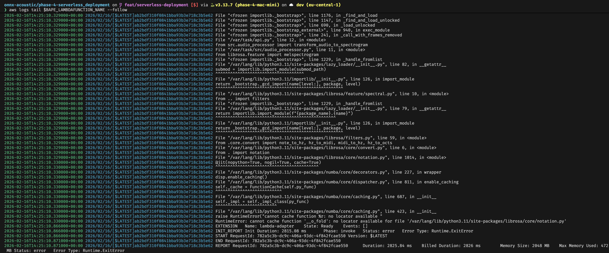

# Phase 4: Serverless deployment

## 0. Intro and Setup

**Intro: End of phase 3 - requirements for phase 4 and lookout**

Phase 3 was secure and performant but a pain of manual work and much too expensive for the use case (~ 2,50 € / day for EIP, NAT-GW, EC2 instance + EBS, ALB combined).

Phase 4 therefor introduces a serverless deployment with Lambda and will explore if the user experience will be acceptable when cold starting a Lambda instance and if this solution meets basic requirements in terms of costs, performance, security and portability/ease of mainatance.

Why serverless?
What obstacles might occur?

**Setup**
- created and reiterated system instructions with Claude Sonnet4.5 and Gemini3 Pro Preview

- phase 4 setup: 
  - new `phase-4-serverless_deployment` folder
    - copied `src/`, `onnx/`, `static/`, `api.py`, `requirements` and `user_data.sh` (for reference)
  - new `feat/serverless_deployment` branch
  - initialize direnv for phase-4-folder

**General questions**
Is my virtual environment set up properly?
Are my system-wide installs clean?


## 1. Architecture

I switch to AWS Lambda to deploy the model via this serverless function as a service model, instead of managing the server infrastructure myself and paying continuosly for the infrastructure's availability, plus the resources consumed when in use. 
With Lambda I will only pay when the function is called and runs. This usually also means cold-starting the compute resources necessary and will foreseeably become a challenge in this phase.


```Mermaid
---
title: Phase 4 Architecture
---


graph LR
    subgraph User Client
    Browser[User Browser]
    end

    subgraph "BAPE - Frontend"
    S3_Bucket[S3 Bucket - Static Website Hosting ]
    end

    subgraph "BAPE - Backend"
    API_GW[API Gateway]
    Lambda[Lambda Function]
    end

    %% Flow 1: Loading the page
    Browser -- 1. GET index.html (including JS) --> S3_Bucket

    %% Flow 2: Using the app
    Browser -- 2. POST Audio --> API_GW
    API_GW --> Lambda
```

Lambda is usually deployed on AWS infrastructure and has no access to any resources located in a VPC, unless public IPs are provided. Lambda functions have access to public AWS services (like S3) and the public internet. 
To access a Lambda function from the public internet an API Gateway is necessary.


## 2. Docker Setup / Containerization

Q1 **Which Docker image?**

I'm not sure how I should have gotten to this question without this explicit guzidance whivh I don't want to rely on.
BUt then I googled container registries and was reminded that I can mainly source my image (most important for the required runtime) either from Docker Hub or from Amazon ECR.

The Lambda function will need to execute our Python3.11 code, so its OS needs Python3.11.

As I want to move forward efficiently I choose an AWS-managed image with Python3.11 installed and found it at https://gallery.ecr.aws/lambda/python.

I opened the Docker Desktop app and Documentation but am not sure how they'll connect to ECR or if I will get the image from ECR and not from Docker Hub.

I created `Dockerfile`in phase 4 root folder and started sketching out a rough draft, as I have no experience writing Dockerfiles.

Q2 **How to solve the `ffmpeg` dependency?**
In phase 2 the main obstacle was to find a workaround for installing `ffmpeg` which was not available via `dnf`.
I sourced the binary built directly from the source and think this will be a `RUN` command in the `Dockerfile`

Q3 **How to translate HTTP events (FastAPI / ASGI) to Lambda JSON events**
I didn't know about this translation problem before and am worried about getting this hint easily from you…
Ad-hoc I found several approaches to this topic, the most popular: aws-lambda-web-adapter by awslabs on GitHub, then AWS Powertools for AWS Lambda by the AWS Community and I found Hono which is a web framework which is interoperable with AWS Lambda and as a web framework should be an alternative to FastAPI!?
My understanding is too shallow here, so my instinct would be to choose the official solution by the awslabs.

Q4 **How to modify `api.py` to expose function to AWS Lambda**
This, too, is a problem, that would have definitely taken me hours to realize in the first place. So I'm worried about always getting the easy way from you but then also I want to move on and make progress… I don't know what to tell you exactly but you get the problem.

To your question… I am clueless. I guess I also understand too little about how FastAPI works to understand the delta from phase3 to 4


--

Crafting the Dockerfile
- had to understand that RUN commands form the ingredients before the CMD command executes the recipe

- Docker caches each line of the Docker file, so copying frequently edited files to the container before other which are rarely edited forces everything to be loaded again

- dependency problems because requirements.in compiled a list of explicit version dependencies which are based on my local dev environemnt.
  - strip requirements.txt of all explicit versions
  - encounter dependency compatibility issues with numpy>2, scikit-learn and scipy -> had to define explicit legacy versions < v2
  - compatibility issue with onnxruntime (undefined version) and my onnx model:

  ```zsh
    onnx-acoustic/phase-4-serverless_deployment on  feat/serverless-deployment [$!?] via 🐍 v3.13.7 (phase-4-mac-mini) on ☁️  dev (eu-central-1) took 8s 
    docker run --platform linux/amd64 -p 9000:8080 bape-lambda
    
    2026-02-09 22:56:40,465 - API CRITICAL - FATAL: Could not load model at startup. Server will fail on requests. Error: [ONNXRuntimeError] : 1 : FAIL : Load model from onnx/super_param_estimator.onnx failed:/onnxruntime_src/onnxruntime/core/graph/model_load_utils.h:46 void onnxruntime::model_load_utils::ValidateOpsetForDomain(const std::unordered_map<std::basic_string<char>, int>&, const onnxruntime::logging::Logger&, bool, const string&, int) ONNX Runtime only *guarantees* support for models stamped with official released onnx opset versions. Opset 20 is under development and support for this is limited. The operator schemas and or other functionality may change before next ONNX release and in this case ONNX Runtime will not guarantee backward compatibility. Current official support for domain ai.onnx is till opset 19.
    ```
  - set onnxruntime to >=1.19.0 to support the most recent opset version (my model is 20)
    - build command failed again:

    ```zsh
    44.72 ERROR: Ignored the following versions that require a different python version: 0.36.0 Requires-Python >=3.6,<3.10; 0.37.0 Requires-Python >=3.7,<3.10; 0.38.0 Requires-Python >=3.7,<3.11; 0.38.1 Requires-Python >=3.7,<3.11; 0.52.0 Requires-Python >=3.6,<3.9; 0.52.0rc3 Requires-Python >=3.6,<3.9; 0.53.0 Requires-Python >=3.6,<3.10; 0.53.0rc1.post1 Requires-Python >=3.6,<3.10; 0.53.0rc2 Requires-Python >=3.6,<3.10; 0.53.0rc3 Requires-Python >=3.6,<3.10; 0.53.1 Requires-Python >=3.6,<3.10; 0.54.0 Requires-Python >=3.7,<3.10; 0.54.0rc2 Requires-Python >=3.7,<3.10; 0.54.0rc3 Requires-Python >=3.7,<3.10; 0.54.1 Requires-Python >=3.7,<3.10; 0.55.0 Requires-Python >=3.7,<3.11; 0.55.0rc1 Requires-Python >=3.7,<3.11; 0.55.1 Requires-Python >=3.7,<3.11; 0.55.2 Requires-Python >=3.7,<3.11; 1.21.2 Requires-Python >=3.7,<3.11; 1.21.3 Requires-Python >=3.7,<3.11; 1.21.4 Requires-Python >=3.7,<3.11; 1.21.5 Requires-Python >=3.7,<3.11; 1.21.6 Requires-Python >=3.7,<3.11
    44.72 ERROR: Could not find a version that satisfies the requirement onnxruntime>=1.19.0 (from versions: 1.15.0, 1.15.1, 1.16.0, 1.16.1, 1.16.2, 1.16.3)
    44.87 ERROR: No matching distribution found for onnxruntime>=1.19.0
    ```

  - onnxruntime not supporting Opset version >19; my model didn't explicitly define an opset version to default to the recommended version -> decision to re-export onnx model with Opset version 19
    - phase 4 folder was already stripped of dependencies necessary for model export --> switched back to phase3 foldern and virtual env
    - needed to re-install bape dependencies omegaconf, hydra-core, torchaudio, onnx, einops, matplotlib
    - exported new model version ending on `_opset18.onnx` -> copied to `../phase-4-serverless_deployment/onnx/`
    - fixed `MODEL_PATH = "super_param_estimator_opset18.onnx"`in `api.py`
    --> `docker run --platform linux/amd64 -p 9000:8080 bape-lambda` successful

- enable ffmpeg to convert non-wav to wav
  - add a function to audio_processor.py which takes ANY input and uses FFMPEG to transform it to an always predicatble wav format
    - _normalize_audio_with_ffmpeg
  - further down in audio_processor.py I need to update `transform_audio_to_spectrogram` so it 
    - expects any raw bytes from the upload instead of waiting to turn a file from path into bytes
    - always triggers `_normalize_audio_with_ffmpeg` function, which normalizes the input and gives it back as audio_array.

In my original function io.BytesIO(audio_bytes) loaded bytes from path but now audio_array is already in byte form and was loaded by librosa.load().
I can jump io.BytesIO() and librosaload() and send audio_array directly into the shape preprocessing:

```audio_processor.py
(…)
audio_array = _normalize_audio_with_ffmpeg(audio_bytes, target_sr=16000)

# Create 2D Mel Spectogram; shape -> (16, 2000)
spectrogram_2d = melspec_preprocessor(audio_array)

(…)
```
After running `docker build …` and `docker run …` another time, the app started successfully.  processed an mp3 and m4a file (see screenshot in `/onnx-acoustic/.local`).

Success: This is a working Serverless, Dockerized, Cross-Platform Audio Inference Engine, which
- accepts ANY audio format (M4A, WebM, MP3).
- sanitizes it to 16kHz Mono WAV.
- runs a complex PyTorch/ONNX model.
- does this in a stateless container that dies after it finishes.

With this setup step completed, I can move on to deploying the container image to AWS and make it available via API GW / Lambda.

Before, I deleted most of the BAPE_src files and anything related to model export which happens locally and must not be committed to the repo.

**onnx/ and src/ clean up: STILL NECESSARY FOR PHASE 3!**
Also, I refactored the shared upload function to display the name of the file upload isntead of input.wav or name it mic_recording.wav when it's not a file upload:

```index.html
(…)
        // --- SHARED UPLOAD FUNCTION ---
        async function upload(blob) {
            const formData = new FormData();

            // LOGIC: Check if it's a file with a name, otherwise default to 'mic_recording'
            let filename = 'mic_recording.wav'; 
            if (blob.name) {
                filename = blob.name;
            }
            // append with file name
            formData.append('audio_file', blob, filename);
        (…)
        }
(…)
```

## 3. Deployment

**What specific AWS service is designed to host Docker images so that Lambda can pull them?**
Elastic Container Registry ECR
- is an extension of both Elastic Container Services and Elastic Kubernetes Service

Features:
- lifecycle policies
- inspector / scan on push
- cross-region cross-acount replication


**Why would an enterprise choose ECR over Docker Hub for a proprietary ML model?**
AWS-managed instead of open-source, higher security standards through IAM credentials instead of username/password

**How does Lambda get permission to "reach into" that storage and pull your 900MB image?**
assumes an IAM role with ECR permissions

**What will happen if you deploy this container with the default settings?**
It will break because of insufficient memory (default is 128MB). The app itself is ~15MB and the necessary software packages slightly < 900MB.

**What memory setting will you start with to ensure the "Cold Start" (initial loading of the model) doesn't take 30 seconds? Justify your starting number.**
The phase 3 t3.small instance has 2GB RAM which we augmented with an additional 20GB EBS volume. This is not an option here.

Actually, I don't want to guess here and would like to run preliminary memory tests which tell us how much compute and memory we approximately need.

But having to guess, I would go with 4GB of RAM for the Lambda function.

### 3.1. Updated Arch: container image, ECR, AWS infrastructure, CORS

```Mermaid
---
title: Phase 4 Architecture after containerization
---


graph TD
    subgraph User Client
    Browser[User Browser]
    end

    subgraph ECR
    bape-lambda[bape-lambda image]
    end

    subgraph "Static Frontend"
    S3_Bucket[S3 Bucket]
    end

    subgraph "Backend"
    LambdaFunctionURL[Lambda Function URL]
        subgraph Lambda-Service
        Lambda[Lambda Function, 
        Python 3.11 ]
        end
    end

    %% Flow 1: Loading the frontend
    Browser -- 1. GET index.html (including JS) --> S3_Bucket

    %% Flow 2: Using the app
    Browser -- 2. POST Audio 
    securley via SSL/TLS --> LambdaFunctionURL
    LambdaFunctionURL -- run inference session --> Lambda

    %% Flow 3: Fetching the image
    Lambda-Service -- get image via 
    IAM Role/Execution Role --> bape-lambda
```

### 3.2. API Gateway or Lambda Function URL?

Looking into the Lambda Documentation the most prominently described options to invoke a Lambda fuction didn't even contain API Gateways.

**Lambda Function URLs vs API Gateway**

| Category | Lambda Function URL | API Gateway |
|---|---|---|
|Cost |no additional cost| cost per call; could be most expensive part of the app|
|Ease of use |easy, low effort setup| more complicated setup|
|Features |integrated with IAM |inegrated with most AWS services|
|Performance| very good | depends
|Security| default: HTTPS | default: HTTP 
|Timeout limits| 15 minutes | 29 seconds |

For elaborate use cases requiring detailed customization options on all aspects of the API an API Gateway is the more robust solution. In this situation where we look for price efficiency and will we need to fit our app into limited resources (especially time out durations), it only makes sense to opt for a Lambda Function URL.

### 3.3. Hosting the front end from a public or private S3 bucket?

Setting the bucket to allow static webhosting requires the bucket to be publicly available.

I'm unsure about this decision. In the current situation I would accept having a public bucket but at the very first moment I share a link to the app I want the bucket to be private and allow all principals to get the index.hmtl (only getting, not listing, deleting, posting). Furthermore only I as the admin role should be allowed to full permissions on the bucket.

If I want the bucket to be private but the index.html still accessible I could do this via ACLs, CloudFront or a bucket policy.

### 3.4. Memory and Performance

Since I didn't know exactly what compute and memory my image container would require, I ran the bape-lambda container another time and ran `docker stats`in another terminal window, where I could see that the app uses 100% of CPU at startup for a couple of seconds, during inference it reaches ~35% while processing a small mp3.
`docker stats` lists Memory Limit as 7,654GiB of which I use less than 10%.

```zsh
CONTAINER ID   NAME             CPU %     MEM USAGE / LIMIT     MEM %     NET I/O           BLOCK I/O         PIDS 
1deceae19ac3   exciting_fermi   0.48%     597.9MiB / 7.654GiB   7.63%     3.04MB / 11.3kB   29.5MB / 2.61MB   38 
```

### 3.5. Drafting the CLI commands to set up the serverles infrastructure

***ECR/DOCKER***

#### 3.5.1. ECR: Create Repository

*Create a repo and set automatic image scanning when pushing to the registry:*
```zsh
aws ecr create-repository \
--repository-name bape-ecr-repo \
--image-scanning-configuration scanOnPush=true
```
Copy AccountID from response for next command or safe to variable.

*Get ECR login and pipe to Docker; allowing Docker to pull/push images to ECR*
```zsh
aws ecr get-login-password | docker login --username AWS --password-stdin $ACCOUNT_ID.dkr.ecr.eu-central-1.amazonaws.com
```

#### 3.5.2. DOCKER: Tag and push the image to ECR
```zsh
docker tag bape-lambda:latest $ACCOUNT_ID.dkr.ecr.eu-central-1.amazonaws.com/bape-ecr-repo:latest

docker push $ACCOUNT_ID.dkr.ecr.eu-central-1.amazonaws.com/bape-ecr-repo
```
*safe the container image URI to variable*:
`$BAPE_LATEST_CI_URI=$ACCOUNT_ID.dkr.ecr.eu-central-1.amazonaws.com/bape-ecr-repo:latest`


#### 3.5.3. IAM: Create trust and permisions policies (trust BAPE Lambda function and permit to pull from ECR and log to CloudWtach)

***IAM***

An IAM role with the permissions to get the container image from ECR, assumable by the bape-lambda function, is required.

1. Trust policy: enables Lambda Service to assume role
    [Trust Policy](../src/bape-trust-policy.json)

2. Permission policy: [Permission Policy](../src/bape-permissions-policy.json)

Create this policy in IAM:

```zsh
aws iam create-policy \
--policy-name bape-permissions-policy \
--policy-document file://src/bape-permissions-policy.json
```
should return BAPE_PERMPOL_ARN --> saved to variable


3. Create an Execution Role for the Lambda function

```zsh
aws iam create-role \
--role-name bape-lambda-exec-role \
--description "execution role for bape-lambda-function" \
--assume-role-policy-document file://src/bape-trust-policy.json
```
saved ARN to $BAPE_EXECROLE_ARN

…copy $BAPE_EXECROLE_ARN, and attach the permissions policy to the role:

```zsh
aws iam attach-role-policy \
--role-name bape-lambda-exec-role \
--policy-arn $BAPE_PERMPOL_ARN
```

#### 3.5.4. Create Lambda function

***Lambda***

Creating a function requires
- a deployment package (container image and its URI or zip file conatining function code)
  - code must be compatible with the target instruction set architecture of the function (`arm64` or `x86_64`, defaults to `x86_64` if not set)
- execution role


```zsh
aws lambda create-function \
--function-name bape-lambda-function \
--package-type Image \
--role $BAPE_EXECROLE_ARN \
--code ImageUri=$BAPE_LATEST_CI_URI \
--memory-size 2048 \
--timeout 60 \
#--ephemeral-storage 4096 \
--description "Lambda function to run inference session against the BAPE onnx model"
```

AWS was rejecting this command with:

```zsh
An error occurred (InvalidParameterValueException) when calling the CreateFunction operation: The image manifest, config or layer media type for the source image 609662023678.dkr.ecr.eu-central-1.amazonaws.com/bape-ecr-repo:latest is not supported.
```

A quick search on the Error made me [learn, that docker exports more modern image versions, including features not supported by AWS Lambda.](https://medium.com/@kvendingoldo/fix-invalidparametervalueexception-for-aws-lambda-docker-images-built-by-github-actions-4369468d52e0)


So I had to strip these features (`--provenance=false --sbom=false`) from the build. `tag` the latest build and `push`again.

```zsh
docker build --platform linux/amd64 --provenance=false --sbom=false -t bape-lambda .

docker tag bape-lambda:latest $ACCOUNT_ID.dkr.ecr.eu-central-1.amazonaws.com/bape-ecr-repo:latest

docker push $ACCOUNT_ID.dkr.ecr.eu-central-1.amazonaws.com/bape-ecr-repo:latest
```


#### 3.5.5. Create the Function URL and debug `403: Forbidden`

```zsh
aws lambda create-function-url-config \
--function-name bape-lambda-function \
--auth-type NONE
#allow all origins
--cors AllowOrigins="*"
```

The resulting live URL responded with:
```
{"Message":"Forbidden. For troubleshooting Function URL authorization issues, see: https://docs.aws.amazon.com/lambda/latest/dg/urls-auth.html"}
```

Following the link I learned that the rescource-based poilcy of the Lambda function mus allow any Principal permission to `lambda:InvokeFunctionUrl` and `lambda:InvokeFunction`

Adding the permissions via CLI:

```zsh
aws lambda add-permission \
--function-name bape-lambda-function \
--statement-id UrlPolicyInvokeURL \
--action lambda:InvokeFunctionUrl \
--principal "*" \
--function-url-auth-type NONE

aws lambda add-permission \
--function-name bape-lambda-function \
--statement-id UrlPolicyInvokeFunction \
--action lambda:InvokeFunction \
--principal "*" \
--invoked-via-function-url
```

--> went from 403:Forbiden to 502:Bad Gateway - Internal Server Error.

As I wanted to see the CloudWatch logs for the error, I realized faulty `bape-permissions-policy.json` because I could not see any Log Groups, when I tried `aws describe-log-groups`. 

Edited the policy and created a new version:

```zsh
aws iam create-policy-version \
--policy-arn $BAPE_PERMPOL_ARN \
--policy-document file://src/bape-permissions-policy.json \
--set-as-default
```

Triggered the Lambda Function URL again and tried again to get the logs but the server responded with a `502 Bad Gateway Internal server error`.

- Was trying for least privilege: ecr auth token only for one specific repo

- Decision: fix custom, least privilege policy or use aws managed policy?

--> Fix custom policy to maintain least privilege strategy:

Initially the policy allowed `ecr:GetAuthorizationToken` only for the specific `bape-ecr-repo`, which I changed to `*`.

Also, I edited the policy to be structured in three different statements: `AllowECRAuth`, `AllowECRPull` and `AllowLogging`:

[src/bape-permissions-policy.json](../src/bape-permissions-policy.json)

Next, another `aws iam create-policy-version …` updated the policy in IAM.

The next curl command still failed but succeeded to create a CloudWatch Log Group.
```zsh
❯ curl https://7ng4jbdvj2cd4s7ewneapjwaai0hyilw.lambda-url.eu-central-1.on.aws/

Internal Server Error%

❯ aws logs describe-log-groups

{
    "logGroups": [
        {
            "logGroupName": "/aws/lambda/bape-lambda-function",
            "creationTime": 1771251906628,
            "metricFilterCount": 0,
            "arn": "arn:aws:logs:eu-central-1:609662023678:log-group:/aws/lambda/bape-lambda-function:*",
            "storedBytes": 0,
            "logGroupClass": "STANDARD",
            "logGroupArn": "arn:aws:logs:eu-central-1:609662023678:log-group:/aws/lambda/bape-lambda-function"
        }
    ]
}
```



#### 3.5.6. Debugging with CloudWatch

Several findings in Logs:

```zsh
2026-02-16T15:41:45.743000+00:00 2026/02/16/[$LATEST]9747eac163aa44aca4abac629f3f4225 INFO lambda_web_adapter: app is not ready after 2000ms url=http://127.0.0.1:8080/
```
Dockerfile edit to increase the timeout of the lambda function:
```Dockerfile
ENV READINESS_CHECK_TIMEOUT=30
```


```zsh
2026-02-16T15:41:46.000000+00:00 2026/02/16/[$LATEST]9747eac163aa44aca4abac629f3f4225 /var/lang/lib/python3.11/site-packages/joblib/_multiprocessing_helpers.py:44: UserWarning: [Errno 13] Permission denied.  joblib will operate in serial mode
```
For this I found two relevant sources:

[Python multiprocessing: Permission denied](https://stackoverflow.com/questions/2009278/python-multiprocessing-permission-denied)
[Note on Joblib with Docker](https://gist.github.com/harusametime/f8b05719d63b56148275997fc6f3d175)

I had to redefine the `JOBLIB_TEMP_FOLDER`:

```Dockerfile
ENV JOBLIB_TEMP_FOLDER=/tmp
```
- Traceback: 

```zsh
2026-02-16T15:41:46.035000+00:00 2026/02/16/[$LATEST]9747eac163aa44aca4abac629f3f4225 Traceback (most recent call last):
2026-02-16T15:41:46.035000+00:00 2026/02/16/[$LATEST]9747eac163aa44aca4abac629f3f4225 File "/var/lang/bin/uvicorn", line 6, in <module>
2026-02-16T15:41:46.035000+00:00 2026/02/16/[$LATEST]9747eac163aa44aca4abac629f3f4225 sys.exit(main())
```

```zsh
2026-02-16T15:41:46.040000+00:00 2026/02/16/[$LATEST]9747eac163aa44aca4abac629f3f4225 raise RuntimeError("cannot cache function %r: no locator available "
(…)
2026-02-16T15:41:46.040000+00:00 2026/02/16/[$LATEST]9747eac163aa44aca4abac629f3f4225 raise RuntimeError("cannot cache function %r: no locator available "
```

The error RuntimeError: `cannot cache function... no locator available comes from Numba.`

Context: librosa uses numba to speed up audio math by compiling it into machine code on the fly (Just-In-Time compilation).
The Problem: Once numba compiles a function, it tries to save a "cache" file to the disk so it doesn't have to compile it again next time.
The Conflict: By default, it tries to write this cache inside the Python library folder (/var/lang/lib/...). In Lambda, that folder is read-only.
The Result: numba panics because it can't find a writable "locator" to save its work, and it crashes your entire Uvicorn process.
The Solution: Redirecting the Cache
Just like we did with joblib, I need to tell numba that the only place it is allowed to "write" its cache is the /tmp folder.
For this I redefine `ENV NUMBA_CACHE_DIR` in my Dockerfile:

```Dockerfile
ENV NUMBA_CACHE_DIR=/tmp
```
**Rebuilding, pushing the container image > rerun the lambda function url**

Again, the startup failed and the joblib error reappeared. Also, even a timeout increase to 60 seconds wasn't enough:
```zsh
65752135-93e2-4cca-9fd7-635695f2b06a    Duration: 60000.00 ms   Billed Duration: 60000 ms       Memory Size: 2048 MB    Max Memory Used: 610 MB    Status: timeout
```
--> The new `READINESS_CHECK_TIMEOUT` variable was irrelevant because I set it to 60 seconds already when creating the Lambda function (see 3.5.4. Creating the Lambda function)

Based on this I wanted to check if the ENV variables never reach the code or if `joblib` was running out of memory (though logs reported only 610MB of 2048MB max usage).


***Check variable settings***

- edit api.py to print the variables to make sure env variables are set correctly

```api.py
print(f"Debug: NUMBA_CACHE_DIR is {os.environ.get("NUMBA_CACHE_DIR")}")
print(f"Debug: JOBLIB_TEMP_FOLDER is {os.environ.get("NUMBA_CACHE_DIR")}")
```
(-> tag and push container image afterwards)

With these steps I learned about the "12-Factor App" principle, which states that configuration should be stored in the environment, while, here, I bake these variables into the Docker file. 
In AWS it's an integrated option (required?) to define `--environment` variables, which is the standard way and allows to change variables without rebuilding the container image over and over.

**Rerun with increased memory and timeout limit**
```zsh
aws lambda update-function-configuration \
--function-name bape-lambda-function \
--memory-size 4096 \
--timeout 120
```

Account was sandboxed to a 3008 MB quota, which could be increased by sending in a support ticket.
For now, I use what I have and increase timeout even more, to 180.

***SUCCESS***
After a long startup time of ~16 sec the app loaded and porcessed uploaded and recorded input successfully.

## 3.6. Feedback, requirement updates, quick fixes and next best actions

I shared the working Lambda Function URL with my collaborator who was very happy with the basic functionality and immediately started to ask questions and make suggestions, which I wrote down

- cold start duration

- update onnx model

- evolve from "1-moment" result to time-based and eventually real-time inference

  - important output, `estimated parameters` is not time-based but generates 21 values reagrdless of input length. These 21 values are a 7x3 matrix in which a triple always describes
  1. the estimation range bottom
  2. the actual estimation
  3. the estimation range top

  - --> single output (as is) the model assumes that the room characteristics, source position etc don't change
    - --> things become interesting when the model can produce a time-series consisting of single-outputs --> time interval or window defined yet.

- possibility to download the exact input the model receives is necessary to evaluate onnx model output
  - spectrogram which is generated at the beginning of our app and which serves as input for the inference session
  - preprocessed audio

### 3.6.1. Cold start duration: 

Double penalty by:
  1. Lambda pulling a 900MB image from ECR, creating a container and allocating memory
  2. Once the container is live my Python code starts with loading heavy libraries (librosa, torch)

Quick Fix – Separation of concerns: 
  1. load static assets from S3 / CloudFront --> frontend instantly available
  2. Wait time occurs when file / recording is processed --> should feel more acceptable

#### 3.6.1.1. Updated Traffic Flow

```Mermaid
---
title: Updated Traffic Flow with Separation of Concerns
---

graph LR

    subgraph Client
    Browser[User]
    end

    subgraph Lambda
        LambdaFunctionURL[Lambda Function URL]
        LambdaFunction[Lambda Function]
    end

    subgraph CloudFront
    CFDistribution[CloudFront Distribution]
    end

    subgraph S3
        subgraph S3Bucket
            index[static index.html frontend]
        end
    end

    %% Frontend Flow:
    Browser -- 1. calls CloudFront URL --> CFDistribution -- is OAC entity trusted by private bucket policy --> index

    %% Backend Flow:
    Browser -- 2. uploads/records input / calls Function URL --> LambdaFunctionURL --> LambdaFunction
    LambdaFunction -- 3. runs inference session / serves results --> Browser
```

#### 3.6.1.2. CloudFront considerations

As I expereinced in phase 3 using self-signed certificates, browsers see HTTP as insecure context and only allow mic access via HTTPS as a security measure so that the mic signal can't be intercepted and decrypted by third parties. CLoudFront automatically handels HTTPS certifcates and thereby ensures a secure context, thus enabling `navigator.mediaDevices.getUserMedia`.

I don't want to make my static project files or the bucket containing them public, so CloudFront will need permissions to access the private bucket. This will be established via an Origin Access Control entity which the resource-based policy of the bucket will grant permissions to `S3:getObjects`, maybe more.

#### 3.6.1.3. CLI: Separation of concerns 
Create
1. the origin

```zsh
aws s3api create-bucket \
--bucket bape-lambda-static-frontend \
--create-bucket-configuration LocationConstraint=eu-central-1

aws s3api put-public-access-block \
--bucket bape-lambda-static-frontend \
--public-access-block-configuration "BlockPublicAcls=true,IgnorePublicAcls=true,BlockPublicPolicy=true,RestrictPublicBuckets=true"
```

2. the identity

```zsh
aws cloudfront create-origin-access-control \
--origin-access-control-config Name=LambdaFrontendOAC,SigningProtocol=sigv4,SigningBehavior=always,OriginAccessControlOriginType=s3
```

3. the distribution

This is a first step into Infrastructure as Code: since CLoudFront doesn't have a flag to identify the OAC, I need to pass in a JSON which also contains the setting of other flags necessary like `--origin-domain-name` or `--default-root-object`.

See [BAPE Lambda distribution config](src/bape-lambda-distribution-config.json).

```zsh
aws cloudfront create-distribution \
--distribution-config file://src/bape-lambda-distribution-config.json
```

4. the resource-based bucket policy

see [s3-bape-frontend-policy.json](src/s3-bape-frontend-policy.json)

```zsh
aws s3api put-bucket-policy --bucket bape-lambda-static-frontend --policy file://src/s3-bape-frontend-policy.jso
```
#### 3.6.1.X. More sustainable outlook:
  
  - look into provisioned concurrency (what is the price increase?):
  [Accurately estimating required provisioned concurrency for a function](https://docs.aws.amazon.com/lambda/latest/dg/provisioned-concurrency.html?sc_channel=sm&sc_campaign=Support&sc_publisher=REDDIT&sc_country=global&sc_geo=GLOBAL&sc_outcome=AWS%20Support&sc_content=Support&trk=Support&linkId=415993615#estimating-provisioned-concurrency)

  - compare to Lambda SnapStart (available for custom containers?):
  [Improving startup performance with Lambda SnapStart](https://docs.aws.amazon.com/lambda/latest/dg/snapstart.html)
    - supports Python 3.12 or later

### 3.6.2. Update onnx model
  - the resulting JSON displayed on the frontend triggered the question which exact weights were used for the onnx model
  - I was able to quickly look into the `MODEL_WEIGHTS_PATH` variable in the `param_estimator-onnx_exporter.py and identify the exact model.pth version I used
  - collaborators suspicion that it's not using the `2025-11-18-17-40-57` version were confirmed

  Quick Fix — Reexport model, update Docker Image without caching, update Lambda function code:

  - made edits (paths and model config) to [param_estimator-onnx_exporter.py](/phase-3-proper-infra/onnx/param_estimator-onnx_exporter.py) in order to export a new model

  Next, I wanted to update the container image on ECR and rerun the Lambda Function URL with the adjusted onnx model, but failed: In the resulting JSON the model path was still the old and I learned that Lambda is not automatically pulling the new image in order to prevent broken pushs.
  So my guess was that I needed to manually tell Lambda to pull the current image:

```zsh
aws lambda update-function-code \
--function-name bape-lambda-function \
--image-uri $ACCOUNT_ID.dkr.ecr.eu-central-1.amazonaws.com/bape-ecr-repo:latest
```

  But this also didn't fix the issue, so I checked my local build and ran
```zsh
docker run --platform linux/amd64 -p 9000:8080 bape-lambda:latest
```

  Running the app on localhost still returned the old model path.
  I needed to make sure docker was not reusing cached information for its build and I needed to start giving the build versions more descriptive name and most importantly changing names so I don't overwrite functional versions by accident.

```zsh
docker build --no-cache --platform linux/amd64 -t bape-lambda:2025-02-17-updated-onnx .
```
This built a new container image which used the corrected model path:

```zsh
❯ docker run --platform linux/amd64 bape-lambda:2025-02-17-updated-onnx cat api.py | grep "onnx/"
MODEL_PATH = "onnx/super_param_estimator_opset18_2025-11-18_17-40-57.onnx"
```

So I tagged the new version, pushed it to ECR and told Lambda to update the function code:

```zsh
docker tag bape-lambda:2025-02-17-updated-onnx $ACCOUNT_ID.dkr.ecr.eu-central-1.amazonaws.com/bape-ecr-repo:2025-02-17-updated-onnx

docker push $ACCOUNT_ID.dkr.ecr.eu-central-1.amazonaws.com/bape-ecr-repo:2025-02-17-updated-onnx

aws lambda update-function-code \
--function-name bape-lambda-function \
--image-uri $ACCOUNT_ID.dkr.ecr.eu-central-1.amazonaws.com/bape-ecr-repo:2025-02-17-updated-onnx
```

This threw an error I encountered already earlier: Docker builds the container image in the OCI Format which Lmbda doesn't support (also see 3.5.4.)

```zsh
An error occurred (InvalidParameterValueException) when calling the UpdateFunctionCode operation: The image manifest, config or layer media type for the source image 609662023678.dkr.ecr.eu-central-1.amazonaws.com/bape-ecr-repo:2025-02-17-updated-onnx is not supported.
```

I needed to rebuild and strip the `provenance` and `sbom` feature:

```zsh
docker build --no-cache --platform linux/amd64 --provenance=false --sbom=false -t bape-lambda:2025-02-17-updated-onnx .
```
and push again to ECR.

Debugging successful — the Lambda function responds with a JSON referencing the correct onnx model file.

### 3.6.3. Evolve to time-series processing

### 3.6.4. Make exact model inputs available

### 3.6.5. Further learnings: versioning
I clearly felt an increase in speed while iterating the app and producing incremental improvements. Initially I planned on having 5 different deployment versions after all but at this point I wanted a tighter handle on versions and make them available for demonstration and comparisons in rertrospect/during job application process.

I decided to keep different lambda versions alive, configure the CloudFront distribution's behaviours to point to multiple Lambda endpoints. Additionally I need to make use of Git tags.

## X. Appendix

```Mermaid
---
title: Ongoing Phase 4 Architecture
---


graph TD

    A@{ shape: diamond, label: "Decision" }

    CloudWatch[Cloud Watch]

    subgraph User Client
    Browser[User Browser]
    end

    subgraph ECR
    bape-lambda[bape-lambda image]
    end

    subgraph "Static Frontend"
    S3_Bucket[S3 Bucket]
    end

    subgraph "Backend"
    LambdaFunctionURL[Lambda Function URL]
        subgraph Lambda-Service
        Lambda[Lambda Function, 
        Python 3.11 ]
        end
    end

    subgraph IAM
    TrustPolicy[Trust Policy]
    ExecutionRole[Execution Role]
    PermissionPolicy[IAM Permission Policy]
    end

    %% Flow 1: Loading the frontend
    Browser -- 1. GET index.html (including JS) --> S3_Bucket

    %% Flow 2: Using the app
    Browser -- 2. POST Audio 
    securley via SSL/TLS --> LambdaFunctionURL
    LambdaFunctionURL -- run inference session --> Lambda

    %% Flow 3: Fetching the image
    Lambda-Service -- Policy-ExecutionRole --> bape-lambda
    Lambda-Service -- write logs --> CloudWatch

    %%Flow 4: 
    TrustPolicy --> ExecutionRole
```


IAM Role has:
Trust Policy: WHO can assume the role
Permissions Policy: WHAT can the role do (Services and Actions)?

Lambda has:
Resource-based policy

AWS Orgainzations / IAM Identity Center:
- Service Control Policies (What services can users access?)