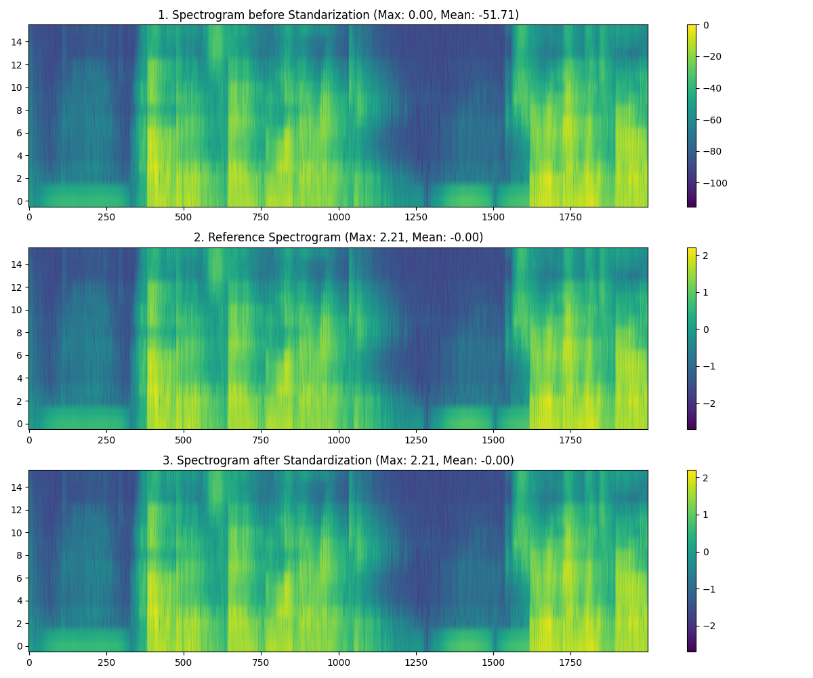

# Phase 5 — Decision Log: Container Orchestration & Infrastructure as Code

Phase 4 bought scale-to-zero at the price of cold starts which is a huge trade-off. Phase 5 makes the service instantly available by moving to always-warm containers on **ECS Fargate**. Fargate containers also allow for persistent instead of event-driven connections which I used to establish WebSocket connections in phase 6 and 7.

In phase 5, the *imperative* CLI work of Phases 3 and 4 becomes *declarative* Infrastructure as Code. Also: the BAPE lead researcher found that the deployed model's estimates did not match the research reference. A substantial part (Part B) of phase 5 therefore belongs to debugging the drift.

Diagrams live in the phase [README](README.md).

---

## Part A: Container platform and IaC foundation

### Decision 1:  Containerize to benefit from the managed orchestration.

**Context.** I decided between 3 AWS-native options to containerize: AWS App Runner, ECS in EC2 mode, or ECS in Fargate mode.

**Decision.** **ECS on Fargate.**

**Rationale.** App Runner would have been the fastest route to a working URL, but it abstracts away exactly the layers I wanted to learn — network topology and task-level IAM. ECS on EC2 is the opposite: maximum configurability, but also OS patching and instance scaling as permanent operational overhead. Fargate keeps full control over the VPC, private subnets, ALB routing and task/execution roles while AWS still owns the host. For a phase whose stated goal is to gain experience using container orchestration I saw this as the right grade of abstraction and difficulty.

**Consequences.** Cold-start problem from Phase 4 disappears and I have a real network topology to design.

### Decision 2: Adopt Terraform, with remote state stored in S3 using conditional writes;  bootstrapped manually

**Context.** Phase 4 ended as a growing pile of imperative CLI calls and JSON config files. Terraform compares `.tf` files against a `terraform.tfstate` file that records the real state of the account — and by default that file lives on one machine, so a possible single point of failure.

**Decision.** Move the stack to Terraform and its state file in a **versioned, encrypted, public-access-blocked** S3 bucket. Let Terraform handle the lock file (`use_lockfile = true`) using S3 conditional writes
The S3 bucket is created by a one-off shell script (`bootstrap_tf_backend.sh`).

**Rationale.** Storing the state file locally is a single point of failure: if the machine is going down, the record of what exists in the account is lost. S3 features encryption at rest, versioning and IAM-scoped access and S3 conditional-write locking solves the concurrency problem: two simultaneous terraform apply runs can't corrupt the state, the second fails with 'state is locked'. The bootstrap script deals with the chicken-and-egg problem: the backend has to exist before Terraform can use it.

**Consequences.** Infrastructure becomes reviewable and reproducible. The bootstrap script and the `bape/phase<N>/terraform.tfstate` key convention carry forward unchanged into Phases 6 and 7. I also adopted HashiCorp's file-naming convention (`backend.tf`, `providers.tf`, `variables.tf`, `locals.tf`, `outputs.tf`) rather than inventing my own layout when starting out, but I tweaked it to my requirements going forward.

### Decision 3: VPC endpoints instead of a NAT Gateway for privacy and cost-efficiency

**Context.** A Fargate task in a private subnet still needs to reach *out* to ECR, S3 and CloudWatch Logs.
I could solve this three ways:
 1. NAT Gateway (the enterprise-standard; expensive, always-on) 
 2. VPC endpoints routing the traffic via AWS PrivateLink or
 3. putting the tasks in public subnets giving them public IPs behind strict security groups.

**Decision.** **VPC endpoints** — an S3 *gateway* endpoint plus *interface* endpoints for ECR API, ECR Docker and CloudWatch Logs. No NAT Gateway, no public IPs on the ECS tasks.

**Rationale.** The privacy argument came first and mattered more than the cost one. This model estimates the spatial characteristics of a room from a microphone recording — done carelessly, that could leak very sensitive personal data. Keeping that traffic on the AWS backbone instead of routing it out over the public internet is the defensible default. Also, HTTPS is a hard requriment for AWS service endpoints (ECR, S3, CloudWatch), so boto3 and the Docker daemon are speaking TLS over that private path regardless
The cost argument adds to the decision because the NAT Gateway was the biggest cost driver in phase 3 and the overall project. The public-subnet option would have been cheapest but puts the inference workload on the public internet, which would equate to the privacy standards of phase 2 and would thus be a regression.

**Consequences.** No NAT Gateway anywhere in Phases 5–7. Interface endpoints are not free either, so the idle bill is reduced rather than eliminated — but the traffic path is private by construction.

### Decision 4: Two-AZ VPC, ALB in public subnets, Fargate in private, security groups chained

**Context.** ALBs require at least two AZs (the same constraint met in
Phase 3) to run and keep compute unreachable from the internet.

**Decision.** A `10.0.0.0/16` VPC with four `/24` subnets across two AZs (two public for the ALB nodes and two private for the ECS Fargate tasks and service endpoints). The ALB listens on port 80 (HTTP is acceptable because all traffic comes from the CloudFront distribution which requires HTTPS and routes forwarded traffic over AWS infra; config of `aws_vpc_security_group_ingress_rule.bape_alb_sg_ingress` in `main.tf`) and forwards to a target group on 8080, the only port the container exposes(`aws_ecs_task_definition.task_definition_bape`). Security groups reference *each other* rather than CIDR ranges: the ALB SG allows egress to the task SG on 8080, the task SG allows ingress *only* from the ALB SG.

**Rationale.** SG-to-SG references express the actual intent (only the load balancer may talk to the tasks) and stay correct as Fargate creates tasks with new IPs. Because ECS service registers and deregisters tasks with the target group itself no target groups are registered by hand, so Terraform only declares the target group, never its members.

**Consequences.** A conventional public-edge / private-compute topology carried over from Phase 3, was created through imperative commands now is translated to declarative IaC. The remaining debt is that the ALB still terminates plain **HTTP on port 80**, theoretically allowing to bypass CloudFront and penetrate the ALBs directly. This was fixed in phase 7 when I changed the ALB SG ingress source from `0.0.0.0/0` to CloudFront's managed prefix list.

---

## Part B — Excursion: the inference-parity bug

> Mid-phase, the BAPE lead researcher compared his training reference outputs against the deployed ONNX model's outputs. They differed and since the BAPE model is deterministic, identical input must yield identical output. So this must have been a bug in either the preprocessing or the ONNX export, and I stopped everything else until I could solve it.

### Decision 5: Inspect the pipeline on a sandbox branch, from a known tag

**Context.** By this point the app had an advanced slicing logic, to put out sequential inference results, FFmpeg normalization and a new
deployment target. These were too many variables to reason about at once.

**Decision.** Open a dedicated `debug/inference-sandbox` branch and revert to the **Phase 4 monolith** ([`phase-4.0-monolith`, `12441f8`](https://github.com/dielaenge/onnx-deployment/tags)) —
the simplest possible *one-shot* inference path at the start of phase 4 and then reintroduce complexity only after the bug was isolated and fixed.

**Rationale.** Debugging the newest, most complex version first is backwards. If the simplest version is already wrong, everything built on top of it is noise. Doing it on a branch off a tag meant the sandbox could be as destructive as necessary.

**Consequences.** The reverted version reproduced the wrong results, which showed that the bug predated all the Phase 5 work.

### Decision 6: Eliminate suspects one at a time instead of guessing

**Context.** The candidate causes were:
- FFmpeg normalization,
- the librosa audio read,
- the Mel spectrogram configuration,
- the exported weights, and
- the export script itself.

**Decision.** Write a standalone [`debug_inference.py`](debug-scripts/debug_inference.py) that:
- loads the reference WAV *without* FFmpeg normalization, and
- runs it through the same librosa MelSpectrogram preprocessor (from the original BAPE repo) and inference call, then 
- compares.

Separately, feed the BAPE lead researcher's reference spectrogram tensor directly into the reconstructed PyTorch model, bypassing my preprocessing entirely.

**Rationale.** Each test removes exactly one variable. The reference file was already 16 kHz mono, so FFmpeg normalization was redundant anyways.

**Consequences.** Without FFmpeg the results were still wrong (differing from the deployed version by ~1e-5, which I attributed to compute-environment differences), so normalization was not the cause. Using the reference spectrogram, the model produced numbers matching
the reference outputs, so the weights, the encoder and the estimator were all loading correctly. That meant that I was producing a faulty spectrogram input.

During a check-in with the BAPE researcher, two important mistakes surfaced:
1. the `SuperParameterEstimator` was constructed with `encoder_state=None`. The model actually consists of a speech encoder and a separate parameter estimator, which have separate weight files from dedicated training runs. Only the estimator's weights were loaded but never the encoder ones.
2. several values in the exporter diverged from the training run's `config.yaml`. And more importantly: I hardcoded them instead of sourcing from the `config.yaml` file using hydra.

**The fix.** The `SuperParameterEstimator` was now initialized with `encoder_state=ENCODER_WEIGHTS_PATH`. Crucially, `load_state_dict(…, strict=False)` was flipped to `strict=True`, so the encoder key mismatch and the faulty results would not be silently accepted (same lesson as Decision 7). 

### Decision 7 (Rather just a finding): A standardization step that was defined but never called

**Context.** I compared my spectrogram against the reference tensor. Shapes matched, the value ranges did not:

| | reference | mine |
|---|---|---|
| Shape | [16, 2001] | [16, 2001] |
| max | 2.208 | 0.000 |
| min | −2.704 | −115.083 |

**Finding.** A standardization method `stdze()`, or `(x − mean) / std`, already existed in the `MelSpectrogram` class but was never invoked in the inference path, so no standardization was ever applied.

**Rationale.** During the check-in I learned that the model was trained on standardized spectrograms, so anything else is *unknown* input,  which produces plausible-looking but wrong numbers rather than an error.
The BAPE lead researcher confirmed the step is required by the convolutional front-end, and noted it is genuinely unusual to standardize spectrograms. So it was easy to miss, even with more domain expertise.

**Consequences.** The standardization resulted in full numerical parity with the research environment, verified locally against the reference file. A [`visualize_spectrograms.py`](debug-scripts/visualize_spectrograms.py) script produced a plot showing before/after standardization results at a glance (*mind the scale*):

The general lesson for me was, again, that a silent preprocessing mismatch does not throw an error, but returns *just* a number. No tool in the stack (ONNX runtime, FastAPI, ECS, …) flags a wrong input distribution. To fix this, the parity check later became a built-in self-test in the exporter rather than a one-off script.

### Decision 8: Standardize the whole spectrogram *before* slicing it

**Context.** Restoring the sliding-window feature (overlapping 4-second windows, one estimate every 2 seconds) after the fix raised an ordering flow question: standardize each slice, or the whole spectrogram?

**Decision.** Standardize the **entire** spectrogram first, then slice.

**Rationale.** Per-slice standardization computes a different mean and standard deviation for every window, so identical audio in the same recording would be scaled differently depending on what surrounds it and so the estimates would no longer be comparable across a recording.

**Consequences.** Stable, comparable estimates across a full recording. It also changed the formatting flow: slices come out of the loop as *numpy arrays* not as *PyTorch tensors*, so `np.expand_dims()` replaced the old PyTorch `unsqueeze()` calls.

### Decision 9: Export with a static batch size, not dynamic axes

**Context.** With the encoder weights now actually loaded and `load_state_dict` set to `strict=True`, reexporting the model failed with `aten::_transformer_encoder_layer_fwd`. It could not be exported to any opset version which supports dynamic batch sizes. The failure was new only because the earlier, broken export had never loaded the encoder weights.

**Decision.** Export with a static input shape of `[1, 1, 16, 2000]` (1 recording/batch, 1 channel, 16 mel bins/height, 2000 time frames / width), one spectrogram per inference call, and loop over batched spectrograms in `inference_engine.py`.

**Rationale.** Phase 5 processes a sequence, not a batch of stacked spectrograms, so dynamic batching was solving a problem the application does not have. Omitting dynamic batching made the export succeed (at opset 18).

**Consequences.** Export successful and a Python-loop batch implementation that I flagged in my notes (*what are the alternatives to a Python loop for sequential inference, and how do they benchmark?*) 

This static shape is still baked into the ONNX graph in Phase 7. 

In phase 4 I hit the same contract from the other side: I'd exported the model at opset=20, but the onnxruntime that installed cleanly into my phase-4 deployment image at the time only supported opset ≤ 19, so the model wouldn't load and I re-exported at a lower opset to match. Before, I had to downgrade the model export configs accordingly.(This wasn't a Python 3.11 limitation — later phases run much newer onnxruntime on the same 3.11; the real constraint was that deployment target at that moment.) 
This decision shows the versioned contract between model and runtime from the opposite direction: the new exporter script expects a newer Intermediate Representation (IR) version and requires `onnxruntime > 1.17.0`. So onnxruntime and model version must match and here I had to readjust the runtime version.

### Decision 10: Vendor the research repo rather than submodule it (for now)

**Context.** The updated exporter sources configs dynamically via hydra instead of hard-conding configs which I accidentally did when first initializing the model during the first export.
For this sourcing I had to decide if I introduce a git submodule or vendor it into my code base.

**Decision.** **Vendor** it into the phase folder for Phase 5.

**Rationale.** Vendoring keeps the project self-contained: the Docker build never has to reach out to the upstream repository, and the phase folder stays independently buildable. Submodules make upstream
updates easy but add real complexity to Docker builds and to anyone cloning the repo.

**Consequences.** Stability now, manual copying if upstream changes. Worth flagging as a decision that was **later reversed** — Phase 7 uses a proper git submodule for the same code, once the exporter had moved fully out of the production image.

---

## Part C — Shipping

### Decision 11: Adding ALB as a second CloudFront origin

**Context.** The frontend was served as a CloudFront distribution's default origin (via HTTPS and from private S3 bucket), while the API calls were directed directly to the ALB's HTTP link. The call from HTTPS to HTTP was blocked by the browser as mixed content.

**Decision.** Add the ALB as a second (custom) origin on the same CloudFront distribution, behind an `ordered_cache_behavior` routing traffic uncached (via `cache_policy_id`) to a relative  `path_pattern = /acou-vec/*`, which the `fetch()` command in the index.html also points to (`const response = await fetch('/acou-vec/generate'`).

**Rationale.** Mixed content is the browser enforcing security standards. With the solution in place the browser only sees an HTTPS call to a relative path of the same HTTPS distribution (pointing to the ALB origin). The browser doesn't care that traffic behind the edge, forwarded to the ALB is HTTP.

**Consequences.** One HTTPS distribution for the whole app. This is a pattern Phases 6 inherits directly while Phase 7 additionally adds `/ws*` and `/api/*` behaviors to the same setup. **Technical debt**: CloudFront serving HTTPS does not improve the low-fidelity plain-HTTP ALB listener security standards.

### Decision 12: `504 - Gateway Timeout` – fix the bottleneck, not the timeout

**Context.** When running a couple of tests on the updated container, longer recording uploads failed with an `504 Gateway Timeout` error. CloudFront responds with 504 when a forwarded request is not responded to within 30 seconds (default value, configurable up to 60s or more via AWS support). It assumes the origin is dead.

**Decision.** Raise the task definition's **CPU and memory** to 1 vCPU and 2 GB RAM instead of reconfiguring timeout limits.

**Rationale.** I interpreted the long processing times as a result of underprovisioning. Solving this by raising the timeout limits would just worsen the user experience and feel just as broken. The responses have to come immediately. Especially since this was possible before and the next step was to move on to real-time inference streaming in phase 6.

**Consequences.** Larger files processed fine and timely. But: I chose that *working* was *good enough*. I wanted to measure what is right, but *right-size via Container Insights* went onto my to-do list rather than getting done.

### Decision 13: CI/CD with GitHub OIDC to prevent long-lived AWS keys

**Context.** Deployment was still manual up until this point: `docker build` > `push` > force new deployment.

**Decision.** Set up the CI/CD pipeline in IAM by 
1. Registering GitHub as an **OpenID Connect identity provider** 
2. giving it a role 
  - whose trust policy is restricted to a **single repository and a single branch** (I was creating all project phases on a dedicated branch, then tagged the milestones and merged), 
  - with permissions scoped to 
    - ECR login, 
    - push to the one repository, and 
    - forcing an ECS deployment.

**Rationale.** I did not want to store my long-lived AWS access key pair in GitHub secrets. Via OIDC, GitHub can issue a short-lived token for each workflow run. 
In my `cicd.tf` I set up a `aws_iam_openid_connect_provider.github_oidc` resource, which is referenced as a federated principal in the next resource I built, `aws_iam_role.github_actions_role`. This IAM role also sets two conditions: `:sub` filters the role to only apply to the phase 5 branch of my repo (respectively phase 6 and 7 branch in the following phases), `:aud` filters the audience only to AWS STS.  The `aws_iam_role_policy.github_actions_permissions` resource is applied to the role and allows S3, ECR and ECS permissions to run the pipeline end to end after pushing.

**Consequences.** When pushing a commit and fulfill the `deploy-phase5.yml`'s conditions a deploy is triggered, using short-lived credentials provided by GitHub requested by the GitHub Actions role which has the required permissions.

### Decision 14: Ship the model from S3 at build time instead of pulling from GitHub or baking it into the container

**Context.** The first CI-built image crashed at startup:

> `FATAL: Could not load model at startup … NO_SUCHFILE : Load model from /app/app/models/…onnx failed. File doesn't exist`

As a binary artifact I gitignored the onnx files I created in my repo. This meant CI checked out a repo not containing any model.

**Decision.** Have the GitHub Actions job **pull the model from S3** into the build context before `docker build`. For this we permitted the GitHub Actions role to list S3 buckets and get S3 objects.

**Rationale.** Three options were considered, one chosen and two rejected: 
  - [ ] Downloading the model at each **container start** reintroduces cold start delays to every single task launch. 
  - [ ] a dedicated model registry (MLflow or similar) is my preferred solution but I deferred it due to overhead at the time. So this item went on my to-do list.
  - [ X ] Downloading the model from S3 during `docker build` requires the CI job to authenticate to AWS via its IAM role which I set up in the last decision. For the S3 download to succeed the `s3:GetObject` and `s3:ListBucket` were required.

**Consequences.** A working pipeline which builds the image abd downloads the model on every push. That is tech debt because model releases are tied to builds, so the model registry soltuion must be integrated in the future.

---

## Outcome

**Cloud Platform:** 
- `10.0.0.0/16` VPC with four `/24` subnets running across two AZs
  - 2 private subnets (`prv-sn-A`, `prv-sn-B`, see [`main.tf`](../../phase-5-container-orchestration/terraform/main.tf))
    - Fargate places task in one of the private subnets
    - interface endpoints are ENIs in *each* of the private subnets  
  - 2 public subnets (`pub-sn-A`, `pub-sn-B`, see [`main.tf`](../../phase-5-container-orchestration/terraform/main.tf))
    - ALB running on two nodes in two public subnets, 
  - S3 gateway endpoint is a route-table entry and thus not located in any subnet
- CloudFront distribution on AWS infra serves the frontend from S3 and the API connection via the ALB.

**IaC:** 
- Entire stack in Terraform 
- Bash bootstrapping script to establish state backend where terraform can initialize, 
- remote state stored in S3 bucket and managed through conditional writes

**CI/CD:** 
- push-to-build-and-deploy pipeline based on GitHub Actions 
- Actions authentication via short-lived OIDC credentials provided by IAM; no long-term credentials stored on third-party platform
- ONNX model pulled from S3 at build time; must evolve to dedicated model registry or other more efficient arch

**Debugged inference drift:** 
- deployed model now computes same results as reference results for a reference input
- drift was due to lack of input standardization.

**Cost shape:** 

Continuous costs by:
- 1 always-on ECS task running on Fargate, 
- 2 ALB nodes 
- interface endpoints for ECR API, ECR Docker and CloudWatch 

This is a trade of *idle cost* for *latency*, the opposite of Phase 4's trade. 

**Debt / To Do:** 
- right-sizing the ECS task by metric indicators / container insights
- subsitute ALB's plain-HTTP listener with HTTPS
- benchmark the efficiency of looping in Python for sequential inference vs. 
  - a true batched / dynamic-axis export (ONNX Runtime's own batching), 
  - or `IOBinding`
- pulling model independently from a model registry

## Lookout for phase 5
This architecture is foundationally determined by static request / response HTTP states, which cannot represent an ongoing audio processing stream. 
All processing (normalization, slicing, inference) can only start when the *finished* recording is received.
The BAPE model itself can continuously consume 4-second slices, one at a time, which is the objective for phase 6: recording, processing and infering a live audio stream. This is achieved by a change of protocol (from HTTP REST API to WebSocket), so the foundational compute platform mostly stays unchanged.
