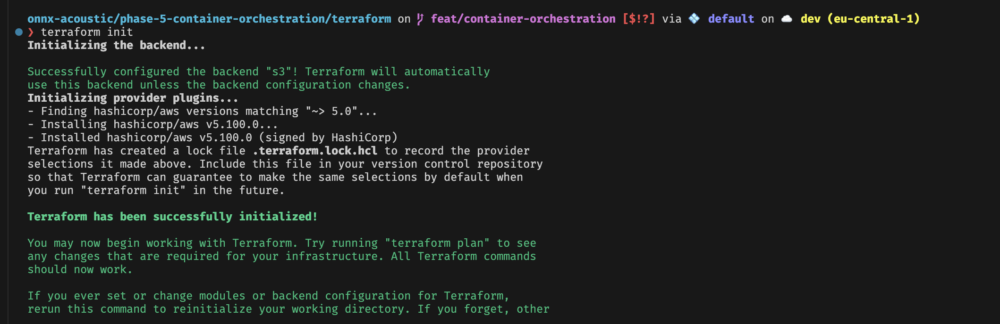
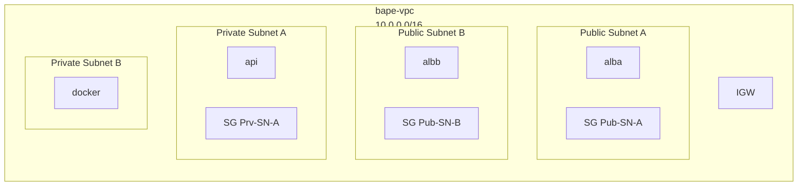

# Phase 5 - Container orchestration

## 1. Intro: Where do we pick up from phase 4?

Serverless is a big improvement from phase 3, especially cost- and maintance-wise but came with obvious disadavantages, like the cold start period for an istantaneous use case.

Moving on, I wanted to elaborate the infrastructure and find ways to minimize latency while keeping costs at bay, and which allowed me to practice essential cloud capabilities like (serverless) container orchestration. For this I also wanted to make a big step in terms of manual architecture and start transfering to automated blueprints, especially using terraform.
For this I decided to pick Elastic Container Service in Fargate (so serverless) mode instead of EC2 mode or not opting for ECS but for AWS AppRunner.
The ladder would be the fastest way to solid results but it's also the way most layers of complexity are absracted away and there is little room to make important experiences on what really happens during container deployment and orchestration. Fargate allowed me to retain complete control over my network topology (VPC, private subnets, ALB routing) and IAM Task security, which App Runner abstracts away. ECS EC2 mode, on the other hand, offers the highest range of manual configurability to build bespoke solutions but also comes with tghe biggest operational overhead (OS patching, instance scaling).
Fargate hits a sweet spot between detail and ease of use.

### 1.1. Mapping the Past to the Future
I created this diagram to show the resources of phase 4 and how they interoperate. This is the foundational blueprint of what we want to build in phase 5 on ECS.

```Mermaid
graph LR

B(S3 Bucket 
        *bape-lambda-static-frontend/*)
C(BAPE Lambda Function)
D([CloudFront Distribution])

1(Trust Policy)
2(Permission Policy)
3(Lifeycyle policy)
4(S3 Frontend Policy) 
5(CloudFront config)
6(Lambda Execution Role)


1 -- allows BAPE Lambda function sts:AssumeRole --> 6
2 -- authorizes service actions on resources --> 6
3 -- deletion after 1 day for subset of objects in --> B
5 -- defines frontend distribution via S3 --> D
4 -- allows *s3:GetObject* --> D
D -- GET --> C
C -- puts objects / generates presigned URLs --> B
D -- pulls frontend --> B
C -- sts:AssumeRole --> 6
```

### 1.2. The state dilemma
Terraform works by comparing .tf files against a terraform.tfstate file, which tracks the "real world" status of an AWS account. By default, this file lives locally. But storing the state file locally is a terrible idea for a production system, because it can't be used by authorized entities when the local machine is down. S3 allows us to securely encrypt the state file at rest, restrict access via IAM and thus make it securely accessible for authorized entities.


### 1.3. The Concurrency Problem
What happens to the state file, when two users run `terraform apply` at once, and what AWS service can we use in conjunction with our state storage to prevent this?
WIthout Amazon DynamoDB, when two or more users try to run the same terraform file the statefile breaks.
With DynamoDB, when we run `terraform plan` or `apply`, Terraform checks a specific DynamoDB table. If the table is empty, Terraform writes a "Lock" to it and proceeds. If another user tries to run apply a second later, his Terraform sees the lock in DynamoDB and says, "Error: State is locked by User1."


## 2. Set Up Terraform

#### [TBD!!] Sketching out phase 5 architecture

##### Dependency Graph for an ECS Fargate Deployment

```Mermaid

graph RL

R(Registry)
IR(IAM Roles)
ES(ECS Service)
EC(ECS Cluster)

ER(ECR Repo)


subgraph VR[VPC Resources]
        N(Network)
        LB(Load Balancer)
        C(Compute)
        VE(VPC Endpoints)
end

subgraph Fargate
        SD
        TD(Task Definition)
        CD(Container Definition)
end

ES 1@--> EC 
ES --> VR
TD --> ER
ES --> TD

1@{ curve: linear }
```


### 2.1. Draft CLI commands for S3 API and DynamoDB before setting up Terraform

For Terraform to store a state file, a storage for that file has to be created first: [Shell script `Bootstrap_tf_backend.sh`](../terraform/Bootstrap_tf_backend.sh)

**Script overview**

*`aws s3api …`*
- create a S3 bucket called `bape-tf-state-davidg-2026`, set to `eu-central-1` via `aws s3api` (mind flag difference to `aws s3 …`)
- enable versioning
- block public access via [`public-public-access-block-config.json`](../src/public-public-access-block-config.json)


*`aws dynamodb …`*
- create DynamoDB table
  - Partition Key `LockID` type set to string
  - billing-mode set to `PAY_PER_REQUEST`

### 2.2. Initialize Terraform
After setting up the S3 bucket and the DynamoDB table we can create terraform/[main.tf](../terraform/main.tf), where we 

- [configure Terraform itself](https://developer.hashicorp.com/terraform/tutorials/aws-get-started/aws-create#the-terraform-block) 
  - which Terraform version
  - which provider  `AWS` as the cloud `provider` and define a `backend` called `"s3"`.

We can now initialize terraform (from the `terraform/` folder):



### 2.3. First resource: ECR repsoitory

see [ecr.tf](../terraform/ecr.tf)

### 2.3 Store first outputs: `aws_ecr_repository.bape-inference-tf.repository_url`

see [outputs.tf](../terraform/outputs.tf)

## 3. Set up Networking

There are several options to build the network infrastructure and integrate Fargate

- Enterprise standard using a NATGW to connect to private Fargate instance--> expensive
- AWS-Native workaraound --> use AWS PrivateLink (VPC Endpoints) instead of NATGW to connect to private Fargate instance / keep traffic in AWS backbone
- Cost-Optimized, less secure --> Public Fargate instance, strict SGs

I choose option b, because the research project actually deals with microphone recordings and making estimates on the spatial characteristics of recordings. That's pretty close to surveillance if done wrong, at least, the data produced can get very sensitive.
What is also good about option B is that it has complexity, which I need to get used to and understand going forward.
I will try to keep costs at bay by auto-scaling fargate and see how I can handle costs for VPC endpoints

sketch out [vpc.tf](../terraform/vpc.tf)


*ad-hoc learnings*
- declare `data` sources before you can grab items

- keep tf files to

*From the Hashicorp [Terraform Styleguide](https://developer.hashicorp.com/terraform/language/style#file-names):*

> We recommend the following file naming conventions:
>A `backend.tf` file that contains your backend configuration. You can define multiple `terraform` blocks in your configuration to separate your backend configuration from your Terraform and provider versioning configuration.
>A `main.tf` file that contains all resource and data source blocks.
>A `outputs.tf` file that contains all output blocks in alphabetical order.
>A `providers.tf` file that contains all provider blocks and configuration.
>A `terraform.tf` file that contains a single `terraform` block which defines your `required_version` and `required_providers`.
>A `variables.tf` file that contains all variable blocks in alphabetical order.
>A `locals.tf` file that contains local values. Refer to local values for more information.
>A `override.tf` file that contains override definitions for your configuration. Terraform loads this and all files ending with `_override.tf` last. Use them sparingly and add comments to the original resource definitions, as these overrides make your code harder to reason about. Refer to the override files documentation for more information.

- Fargate dynamically creates and deletes containers with changing IP addresses > no manual target group attachments required, only target groups themselves

- *look into*: advanced HCL syntax

- rubber ducky ALB story:
  - what is an ALB?
        An AWS resources "projected" into a user's VPC, balancing the load to different target groups, which are ealth checked and targeted based on check results.
        - Application Load Balancers(Layer 7)
        - Network Load Balancers (Layer 4)
        - Gateway Load Balancers (Layer 3)

  - what is connected with an ALB?
        ALB is registered to one or more targets in one or more target groups across one or more AZs
        One or more listeners are added to the ALB
        listener checks for connection requests from clients using a configured port and protocol
        ALB routes connections based on rules attached to listener
        rules include priority, >=1 actions, >=1 conditions
        each listener has 1 default and optionally additional rules


  - what is in the VPC and what is outside?
  ALB nodes are in the VPC, the ALB is running on regional AWS infra

  - what is the user flow? what is the code flow?

  client request --> listener --> listener rule --> condition --> action

  incoming request --> Docker container ports in VPC --> AWS Fargate --> Scaling, Maintenance, etc on AWS --> traffic back (?)

- NACLs restrict access on subnet level (OSI-Level 3)
- security groups allow traffic on ENI level (TCP, UDP, ICMP)

- Gateway endpoints are projected into subnets with ENIs

- Fargate projects cluster endpoints into a VPC; not sure in which form

- within ECS, 
  - a task execution role allows ECS to access AWS services
  - a task role allows application code (on the container) to use other AWS services

- AWS Services (ECR, S3, CloudWatch) require HTTPS. Because Boto3 and the Docker daemon use HTTPS to talk to those endpoints, that traffic is TLS-encrypted

- Container definitions are used in task definitions to describe the different containers that are launched as part of a task.

-struggling to understand the attachment of a managed policy in terraform – is this a data source use case?

- think of IAM roles as keychains with two parts:
  - TRUST-POLICY (like an identifier tag): Who gets to use the keychain?
  - PERMISSIONS-POLICY (actual keys): Which keys come with it?

- within ECS we need a keychain for
  - (execution role) for ECS Fargate
  - (task role) for our Code (Boto3, S3, Cloudwatch…)


===

INFERENCE DEBUGGING
see [Inference Debugging Notes / artifacts on branch `debug/`](inference-debugging.md)

===

- Back at `commit 042b8ed`
- pulled changes made on IntelMB

- refactoring `audio_utils.py` to use fixed preprocessing on *moving window/time-sliced* input
  - the fix (standardization) must be applied to the *entire* spectrogram, *before* slicing



