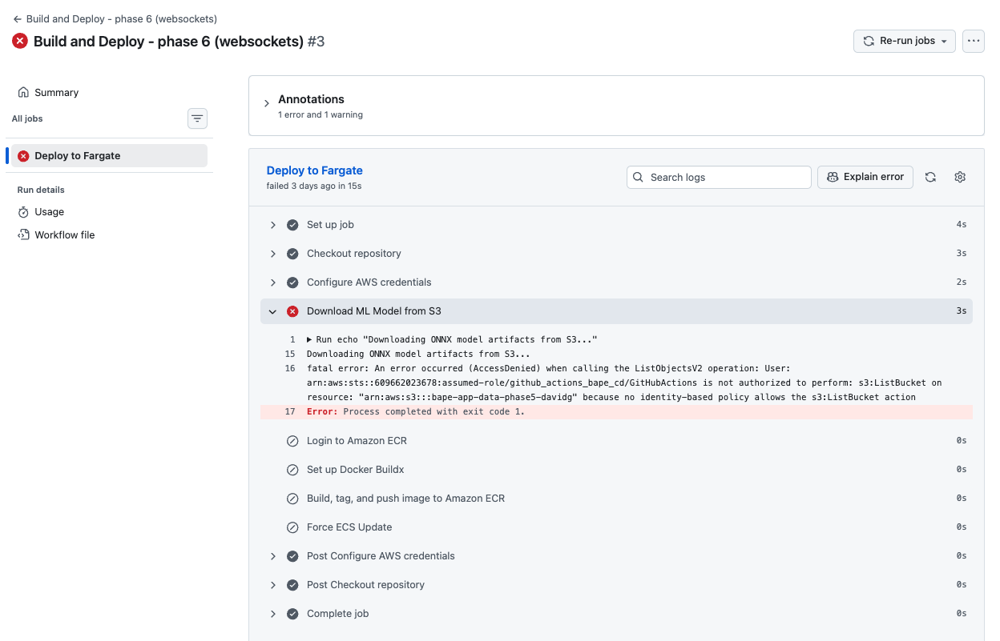

# Notes Phase 6

**Duplicate from end of notes_phase5.md:**

> - Refactored terraform folder
 > My tf file structure was based on some best practices I found from Hashicorp but couldn't find again ad-hoc, so now I feel like we we are in transitiionig state. 
> I pciked apart the main.tf and created ecr.tf, ecs.tf, elb.tf, iam.tf, routing.tf, security-groups.tf, vpc.tf and vpc-endpoints.tf by copy pasting the according blocks from main.tf to the separate tf files.

> Before making the transition to phase 6 I wanted to do the rightsizing so I decided to go back to phase 5 on feat/container-orchestration (where the phase 6 folder is still in untracked status, though I added and pushed it to feat/production-ready, the phase 6 branch) and ran tf apply and then ran our build and deploy to ECS Action because before applying it was failing with Could not assume role with OIDC: No OpenIDConnect provider found in your account for https://token.actions.githubusercontent.com an dI don't know how much it added to failure but GitHub asked from which branch I wanted to run the workflow. FIrst I chose main. For the second run, after running tf apply I set this to feat/production-ready. The second run succeeded. I ran a couple of inferences with the 3.5MB mp3 and I got some numbers in container insights but I struggle to read them. I can see that not only one but two containers are in my cluster. The max CPU utilization I can see is around 36% and max Memory utilization around 20%

## Splitting main.tf

Switched back to `feat/production-ready` restructured files in `terraform/` to split bloated `main.tf`.

## Rightsizing task definition

Set `containerInsights setting` to `enhanced` in `bape_cluster` resource definition.

Set `aws_ecs_task_definition.task_definition_bape` to `cpu = 768` and `memory = 1024`.
  - `cpu = 768` and `memory = 1024` were not valid settings
  - `cpu = 1024` and `memory = 1024` were not valid settings
--> back to [documentation](https://docs.aws.amazon.com/AmazonECS/latest/APIReference/API_TaskDefinition.html#memory)

With the rough numbers from Container Insights (we used 36% of 1024 MB CPU, ~370MB, and 20% of 2048MB Memory, ~410MB), the amount of memory we give determnines the possible cpu size: to right size we must provide more than 256 MB cpu, 1024 like we did or 512 to save on resources. I opt for the latter for development. With a 512 MB CPU, we can set memory to 1024 (1 GB), 2048 (2 GB), 3072 (3 GB) or 4096 (4 GB).

I suggest going with 512 MB CPU, and 1024 MB Memory so that our measures are around 50% of maximum capacity

- zsh: `tf apply -target="aws_ecr_repo…`
- zsh: `tf apply`
- GitHub Actions: `build-and-deploy-to-ecs.yml` workflow, run on `feat/production-ready` branch, successful?

First try failed because `aws_iam_role.github_actions_role` was still conditioned to only access `feat/container-orchestration` branch.

Second try successful: CPU peaks at startup (~50%; `ort.InferenceSession`) and is easily doing bigger inferences (115 spectrograms / 3.5MB mp3 loads 30%), initializing the model and then keeps at around 40% memory while having the model cached and ready for inference.

--> TBD: Simulating traffic with [k6](https://k6.io/open-source/) or [artillery](https://www.artillery.io/docs)

--

## Breaking down the monolith pipeline

ATM each user upload is fully processed before another user can be served. So, if >1 users send an audio upload, before the second user is processed the system has to:

1. Receive the upload
2. Start FFmpeg and normalize audio
3. Create Spectrogram
4. Create two presigned S3-Links and upload normalized wav and spectrogram png
5. Slice the spectrogram and run inference iteratively on slices
6. Return JSON
--
7. Viz is rendered on frontend

This pipeline can induce time-out errors for waiting users (when? --> load testing).

I want to look for ways to decouple inference from upload and preprocessing


Decision: Async Decoupling Mechanism

| Criteria        | SQS + ECS | Step Functions | FastAPI Background | Comments |
|-----------------|-----------|----------------|--------------------|---------------|
| Cost            | The SQS queue itself will cost 0, but the Worker reading the queue requires a second ECS Fargate task running constantly to poll the queue, so per-session compute cost essentially doubles (API container + Worker container). In an apply/destroy model, this is pennies, in prod this can become a fundamental difference. Load Balancer and VPC currently most expensive  | 4000 state changes free; above: 0,25 USD / 1000 state changes; I assume we would have 2 state changes per entire function, so 2k calls/mth free |         0          |  |
| Complexity      | SQS is vastly simpler as it is just a buffer — push a JSON message to it, and another script pulls it. | Step Functions requires writing Amazon States Language (ASL) JSON to define state machines, managing input/output path transformations, and handling distinct IAM roles for every step. For a single-step background job, Step Functions is massive overkill. | low, so would add as a quick win |
| Fit for BAPE    | Best fit I see for splitting upload, preprocessing, generating presigned urls for generated wav / png and inference | Calling a Lambda function takes too long if cold-started, paying for warm functions exceeds ECS costs  | Nice to handle the current processing time more elegantly, but irrelevant to my cloud engineering skill set |
| Resume value    |   *****   |      ****      |          *         |

**Decision:** I tend to SQS because it suits or requirement for low latency while splitting the different application steps allowing me to better monitor the separate processes and eventually fine tune resources to the separate steps as need may arise.
BUT: We are aiming for a real-time application in this phase and using asynchronous decoupling (SQS) might counteract to the objective.

**Trade-offs accepted:** By choosing this, I am accepting that I'm not learning Step Functions at this point, but I think for my use case, step functions would not benefit Paul's experience at this point.

**Further thoughts:** If I understand correctly, we could improve the UX by making the call to our app a FastAPI Background Task and give the user a chance to learn more before results come in… that is, at this stage. 
BUT: a non-negotiable requirement for this phase is the real-time functionality… maybe if the cost structure requires it, we can make the real-time app a lambda function and possible cold starts are sort of moderated… If we go this way we have to mind the timeout limits and I have no idea if websockets can be part of a serverless lambda function.

**Other options researched:** Celery, the Python industry standard for async decoupling, but requires a Message Broker (like Redis or RabbitMQ) to hold the queues. Running Redis on AWS means ElastiCache, which has no free tier and costs ~$15/month minimum. SQS is serverless and free --> chose the AWS-native, cost-effective route over the traditional Python route. 

### Distributed vs. real-time app dilemma

A distributed app with SQS would look like this:

1. Client sends audio via REST API
2. API container processes upload (What does that mean? I just see that there's an upload function in the index.html JS and a read() function in the main.py)
3. Sends JSON notif to SQS queue ("Upload done.")
4. Worker Container pulls JSON
5. Worker Container transforms audio with ffmpeg, creates spectrogram, slices spectrogram, creates pre-signed urls, uploads transformed audio and spectrogram to S3 presigned url and runs inference loop
6. When done Worker COntainer sends JSON to other SQS queue ("Inference Done.")
7. Client polls SQS queue
8. When available, JSON result is sent to frontend (not saved to S3 or DynamoDB)

Decoupling means splitting synchronization and I need to understand if we are aiming to orchestrate separate tasks or choreograph dependent tasks.

In a real-time application synchronization is a must-have, esepcially when it's executing all the same steps in the same order in any form of use. So besides getting deeper insights on different processing steps, I don't see a benefit in decoupling task when aiming for a real-time application result.

BAsed on 
Pauls requirements: - real-time

Portfolio requirements:
- cloud engineering skills; can't tell if distributed architectures or streaming are more sought after, I would guess distributed architectures is a hotter topic but I don't know

I would decide on the "client"'s requirement and make it real-time instead of distributed.

Opting for a real-time solutions, three hurdles arise:
1. How to deal wth the 2-second stride and overlap we introduced when evolving from one-shot inference to time-series inference loop? WHat does the client and what does the backend do?
  a. if the client sends chunks like [0s-4s], [2s-6s], [4s-8s], … 
    - we force the client to doublke it's upload bandwith as we effectively send everything twice
  b. if the client sends chunks like [0s-2s], [2s-4s], [4s-6s], … 
    - the backend can keep the every previous chunk in memory as it is stateful and thus can concatenate it with the current one for inference (equaling a required 4second input); BUT this requires state management on the backend

  DECISION: b. Improve usability on the client side and improve my dev experience with a steeper learning curve.

2. The last deployment used `normalize_with_ffmpeg()` to convert any audio file to 16kHz, Mono Wav. FOr this to happen it saves the full audio to the backends `/tmp` folder and then also writes the converted file to this folder. Doing so every two seconds will weigh heavy on the backend resources.
The JavaScript Web Audio API allows to natively record audio in 16kHz, Mono WAVs.

Reading the doc. I understood we can use `stream` (from `const stream = await navigator.mediaDevices.getUserMedia({ audio: true });` in index.html) as Input for `createMediaStreamSource(stream)`.
I will need to define an audio context and a source like

```JS
const audioCtx = new AudioContext();
const source = audioCtx.createMediaStreamSource(stream)
```

3. Up until phase 5, I developed the frontend to display an audio player and the spectrogram after uploading them to presigned URLs. Continuing this in a real-time set up and concatenating images and/or audio chunks would bloat the payload. BUT: This offers an opportunity to add this functionality as a distributed Lambda function which serves both in parallel.

---

Streaming sandbox
In commit `edfe20b1bedfb33b9505e3a2ed138a8c6e502886: TEST: streaming_sandbox/ holds sandbox files to prototype websocket arch sending/receiving text strings.` I prototyped a websocket connection receiving and sending text strings. 
In our production pipeline the transmitted format should be raw bytes, already in the correct format (16kHz, Mono, float32array), in order to skip the ffmpeg conversion.

So, what needs to be done on 

… the frontend side (Web Audio API - JavaScript)?
  - initialize a new audio context
  - grab the microphone input
  - use an [`AudioWorklet`](https://developer.mozilla.org/en-US/docs/Web/API/AudioWorklet) to intercept the raw audio data (a Float32Array)
  - convert array to bytes and send it via websocket, using `ws.send()` (I will need to buffer the input on the client side, up until 2seconds of data are available and are ready for sending)


… the backend side (FastAPI - Python)?
  - edit sandbox script to receive bytes instead of text strings (`await websocket.receive_bytes()`)
  - convert bytes to NumPy array (`np.frombuffer()`)
  - manage stateful buffer

The Logic
- an empty `audio_buffer` NumPy array is defined outside the `while True` loop
- when 2 seconds of audio are received, they are appended as a chunk to the `audio_buffer`
- when the buffer has a length of `64000` we have 4 seconds of input (`4 * 16000`) and can run inference on it (log or print what's happening!)
- cut the buffer in half and keep only the latter part to concatenate with the next 2 secs of input
  - this creates the stride / overlap

---

To process the raw bytes, the old and deprecated but apparently easier way is to use the [`createScriptProcessor()`](https://developer.mozilla.org/en-US/docs/Web/API/BaseAudioContext/createScriptProcessor) method of the `BaseAudioContext` interface. This feature was replaced by `AudioWorklet` and the `AudioWorkletNode` interface, which is more complex.
The `AudioWorklet` runs in a separate thread, which allows for more efficient processing of audio data without blocking the main thread. However, it requires writing a custom audio processor (`processor.js`) in JavaScript, which can be more complex than using the `createScriptProcessor()` method. Still, I didn't want to build on deprecated tools just for simplicity. After all the usability of the app will be key and I can't allow the possibility of the script not being compatible on modern browsers.
A separate article on [Background audio processing using AudioWorklet](https://developer.mozilla.org/en-US/docs/Web/API/Web_Audio_API/Using_AudioWorklet) was also very helpful to understand the processing concepts at play, like [AudioWorkletNode](https://developer.mozilla.org/en-US/docs/Web/API/AudioWorkletNode) or [AudioWorkletProcessor](https://developer.mozilla.org/en-US/docs/Web/API/AudioWorkletProcessor).

When switching to AudioWorklet and to multi-threading (read *separated* threads) our scripts can't share variables but instead need to send messages back and forth to communicate (similiar to distributed microservices).

---

### Prototyping the streaming engine

As emtnioned before I needed to create a dedicated `processor.js`. WHat does it do?

1. It defines `RealTimeAudioProcessor` class which extends the `AudioWorkletProcessor` with a `process()` function
2. `process()` 
  1. takes the audio input and splits off the left channel to make it Mono and is saved as `inputLeftChannel`
  2. If there is `inputLeftChannel` available it is transformed to a `Float32Array` and saved as `data``
  3. It sends `data` via WebSocket.
3. Registers the new class to make it available for other parts of the pipeline.

In `index.html` the `processor.js` is loaded as a module and made controllable via a `workletNode` (based on audioCtx and using the registered processor as named in `processor.js`). The node is connected to the mic stream, which it will process.
The node listens and when it gets a message (Float32Arrays from processor.js)…
…it saves the data from `processor.js` as `rawFloats`.
…it loops through `rawFloats` and pushes them to `chunkBuffer`
…when `chunkBuffer` is 2 sconds or longer (>=32000 samples)
  …it is spliced to exactly 2 seconds / 32000 samples and defined as `chunkToSend`
  …`chunkToSend` is turned into a `new Float32Array()` called `payload`
  …`payload` is sent via websocket

In `main.py`, 
- we receive the payload via `receive_bytes()`, 
- convert it to a float32 np array
- concatenate it to the `audio_buffer`
- when `audio_buffer` holds 4 seconds of input, inference is run (not executed in first prototype.)
- the first half of `audio_buffer` gets discarded, making space for concatenating new streaming input

In order to let my browser allow microphone recording without SSL encryption (as it is not encrypted, when I test locally, I had to set the host from `0.0.0.0` to `127.0.0.1`). The test run was successful and produced the desired print statements:


The architecture works as desired. 

But, as can be seen, the model is loaded multiple times because I set `reload=true` in the `uvicorn.run()` command. The model is loaded into the *global scope*(?). For local deployment this is acceptable, but on a production server it would not be as this loads the same model multiple times into RAM wasting memory for no reason.
In the next stage, I will solve this by using the **Lifespan Context Manager** feature. It tells FastAPI to wait until the worker is completely booted up, load the model *once*, forward it to the app, and finally clean it up when the server shuts down.

### Port prototyping code to production files

What needs to be done?

- copy logic from `streaming_sandbox/main.py` and `streaming_sandbox/index.html` to `app/main.py` and `src/index.html` 

- before, D3.js rendered a "finished" input as a whole, now, the frontend JavaScript needs to receive the JSON sent via WebSocket coninuosly and append it to the chart as time moves forward

- as I decided against building the architecture based on an SQS worker, not much of the terraform infra needs to be changed as the ALB I already built support the websocket protocol natively. Really only the code inside the ECS container changes, so I primarily need to replace the container and leave the rest as is

**REMINDER:** 

I must make sure to memorize… 
- why I decided against the SQS approach (decoupling ≠ real-time)
- why I skipped the FFmpeg normalization (wasting RAM on the backend, increasing latency)
- how I skipped the FFmpeg normalization (handle audio transformtion on client side via Web Audio API)

---

Implementing real-time functionality by editing 

- index.html:
  - initialize audio context and worklet node
  - connect worklet node to micStream
  - listen for messages from worklet node and send them to backend via websocket connection
  
    *Commits*: 
    - *3b415a22346ddc93a248f2be9789835b1a64ee42*


- main.py
  - implementing asynccontextmanager to load ML model and preprocessor only once
  - implement stateful buffer to concatenate incoming audio chunks and run inference when 4 seconds of input are available
 
    *Commits:*
    - *51b65152445c2a1381fdb0d4854b73c7b1ee9149*
    - *9ce3332df5d55691edeee0799af43e3cbff50ac1*


## Back to Terraform

After spending most of the phase rebuilding system architecture in Python and JavaScript, I'm getting back to the cloud engineering and deployment side.
By doing so the UX benfits from not using a queue, a background worker and a database, but instead using the users browser to take over part of the payload and delivering results in near real-time.

As I am not using SQS and thus not building a worker, the changes in Terraform are few:

The container definition in `ecs.tf` needs to change the new container image containing the real-time streaming code.
Also, a streaming session must stick to a specific container or otherwise input chunks will be sent to different containers and the state machine will break.


The ALB `idle_timeout` is not set and will therefor default to `60`. Thus the process will break after this, so I will explicitly set it to `3600`, 60 minutes.

### Stickiness
Researching the stickiness of sessions I found that there is stickiness for `aws_lb_target_group` but also `aws_lb_listener` and was wondering about the difference. This [same question was asked before on StackOverflow](https://stackoverflow.com/questions/72576527/stickiness-in-elb-listener-vs-elb-target-group) , which received a great answer:

> So to summarize, the aws_lb_listener setting is a separate stickiness setting that only applies to weighted target groups, and "sticks" the traffic to a specific target group, not individual targets. The aws_lb_target_group stickiness setting "sticks" the traffic to an individual target.

> Unless you are using multiple weighted target groups, you will want to always use the aws_lb_target_group setting for session stickiness. If you are using weighted target groups and also need sticky sessions then you would enable it in both places. If you don't normally need sticky sessions, but you do want to "stick" to a specific target group for some reason, like in a blue-green deployment scenario, then you would only enable it at the listener level.

So it became clear that I would set the stickiness on the target group of which I have only one, question is if `app_cookie` or `lb_cookie`, as these are the two options for application load balancers.
I'm not entirely sure, but from what I could pick up, the `app_cookie` is specifically bound to an app's lifecycle, which would make sense in my case, as our app runs as long as the websocket connection is open.

FINDING: What I researched related to REST APIs and standard HTTP connections, where usually a connection is created, some message is sent and the connectio is closed.  
So, HTTP is a stateless protocol and works in a request-response mechanism. On every HTTP request, a TCP connection is established with the server over the socket. 
For multiple turns of exchange, a client won't be reidentified by the server during multiple turns of exchange. Cookies and session stickiness solve this.

On the other hand, and as I saw during websocket implementation, the websocket protocol opens a persistent TCP connection and only closes it at the end of a user session. Stickiness is baked in.

The described differences between the HTTP/S and WS/S protocol (Layer 7 in the OSI model) make clear how they relate differently to TCP on Layer 4.

Relevant readings:
- [REST vs Websockets](https://www.baeldung.com/rest-vs-websockets)
- [AWS Compute Blog: Using WebSockets and Load Balancers](https://aws.amazon.com/de/blogs/compute/using-websockets-and-load-balancers-part-two/)
- [GeeksforGeeks: How to Use WebSocket and Load Balancers?](https://www.geeksforgeeks.org/system-design/how-to-use-websocket-and-load-balancers/)

Perspective readings
- [WebSockets at Scale: Architecture for millions of connections](https://websocket.org/guides/websockets-at-scale/)
- [The Design Principles of Intelligent Load Balancing for Scalable WebSocket Services Used with Grid Computing](https://pdf.sciencedirectassets.com/280203/1-s2.0-S1877050919X0006X/1-s2.0-S1877050919303576/main.pdf)


Moving forward, I understand that, once a websocket connection is established, the pipe is fixed and doesn't need cookies or further stickiness configuration. So how do I establish a WS connection?

The Headers: When a browser tries to open a WebSocket, it sends standard HTTP requests with two very specific Headers that tell the server to switch to a WebSocket. What are the names of those two headers?
A websocket connection is opened just like a usual HTTP connection but comes with two distinct headers `CONNECTION: UPGRADE` and `UPGRADE: WEBSOCKET`. These set the stage for a persistent websocket connection.
By default, CloudFront strips those headers out before sending the request to the ALB. From the [AWS docs](https://docs.aws.amazon.com/AmazonCloudFront/latest/DeveloperGuide/distribution-working-with.websockets.html#distribution-working-with.websockets.recomended-settings) I learned that I either have to attach the AllViewer origin request policy or forward specific request headers and I chose to use the former, so now, my ordered cache behavior, the one defining the distribution to ALB connection, uses `origin_request_policy_id = "216adef6-5c7f-47e4-b989-5492eafa07d3"`.

In phase 5 our distribution was set up to cache `GET` and `HEAD` methods, but as we now will get real-time results on an ongoing basis I disabled caching entirely by also [using a managed cache poolicy id (`CachingDisabled`)](https://docs.aws.amazon.com/AmazonCloudFront/latest/DeveloperGuide/using-managed-cache-policies.html#managed-cache-policy-caching-disabled), more specificall by setting `cache_policy_id = 4135ea2d-6df8-44a3-9df3-4b5a84be39ad`.

Using these policy IDs saves me from writing my own caching policies but the numbers will become cryptic as soon as I move on, so I tried to find a more elegant way by using data sources with the human readable names of the policies and then referencing them in the origin distribution, like `origin_request_policy_id = data.aws_cloudfront_origin_request_policy.all_viewer.id`.


--
review call with Philipp

- spectrogram is input for onnx model, so we have the data for the spectrogram anyways and it should be okay, also from a computing perspective to plot the spectrogram in real-time as well

- right now, inference is run every two seconds, would be nice to run it much more often, like every 0.01 seconds
--

***Running the updated terraform code***

- ususally I had to target apply the ECR repo first and push the updated image manually before running the entire apply command

- building on phase 5 where we ended with a GitHub CI/CD Action, I would only need to build the repo but needed to edit `/.github/workflows/deploy.yml`
  - I separated it to `deploy-phase5.yml` and `deploy-phase6.yml`, edited branches, environment variables and working directories accordingly
  - ran the updated deploy-phase6 workflow on the feat/production-ready branch but failed because of a missing iam_openid_connect_provider and IAM role for the GitHub Action
    - had also to be target applied first:
    `terraform apply -target=aws_iam_openid_connect_provider.github_oidc -target=aws_iam_role.github_actions_role`
  - the next GitHUb Action run failed as well but this time during the workflow:

    From the GH Actions Log:
    ```
    > Run echo "Downloading ONNX model artifacts from S3..."
    > Downloading ONNX model artifacts from S3...
    > fatal error: An error occurred (AccessDenied) when calling the ListObjectsV2 operation: User: arn:aws:sts::609662023678:assumed-role/github_actions_bape_cd/GitHubActions is not authorized to perform: s3:ListBucket on resource: "arn:aws:s3:::bape-app-data-phase5-davidg" because no identity-based policy allows the s3:ListBucket action
    > Error: Process completed with exit code 1.
    ```
    

  - so my `deploy-phase6.yml` was still pointing to the phase5 app bucket, for which the github action IAM role had no permissions -> corrected to phase6

  - after taking a break and destroying everything I came back and started with the targeted applies first: `terraform apply -target=aws_iam_openid_connect_provider.github_oidc -target=aws_iam_role.github_actions_role -target=aws_ecr_repository.bape-phase6-inference` and then `tf apply` which looked good before confirming, although it said it would destroy the phase5 frontend and app buckets, which will fail because they are not empty
    - this error was caused because the s3 backend key in `backend.tf`'s of phase 5 and 6 were still pointing to the same `.tfstate` file
      - separated keys to `"bape/phase6/terraform.tfstate"` and `"bape/phase6/terraform.tfstate"`
      - initialized terraform again for phase 6 with `tf init -reconfigure`
      - ran `tf destroy` then target applied the pre-required resources
        - ran into errors because dependencies were missing -> needed to augment target applies
      - when GitHub Action failed on ECS commands but succeeded on ECR commands, I knew the repo was available and the entire `apply` command could be run, which then would also enable the complete GitHub Action
      - `tf apply` produced errors for already existing resources which must have been created before the reinitialization of terraform, so I needed to delete the flagged resources
      
      (end of day – for tomorrow: 
        - be precise in which resources must be available for the repo to be available
          - the github OIDC provider
          - the GitHub Actions IAM role
          - the bape-phase6-inference ECR repo and
          - the IAM role policy for the github actions permissions
        
        - target applies are not acceptable in production - MUST BE SOLVED
        
        - not all resources are properly tagged in terraform!!
          - [implemented `default_tags`](https://developer.hashicorp.com/terraform/tutorials/aws/aws-default-tags?in=terraform%2Faws)
        
        - use data sources where possible and suitable
      )

May 19

started the day by implementing default_tags and give individual resources a specific name tag to keep things clean. Then I ran the targeted apply for
- the github OIDC provider
- the GitHub Actions IAM role
- the bape-phase6-inference ECR repo and
- the IAM role policy for the github actions permissions

Then I ran my `Build and Deploy - phase 6` workflow (which ran fine, just not updateing the ECS service) and then ran the entire `terraform apply` which also went fine.
I uploaded the model files to the app-data bucket and the `processor.js` and `index.html` to the frontend bucket. 
Everything looks good, but I don't know how to properly edit the websocket url, which is still: 

```
let ws = new WebSocket("wss://localhost:8000/ws")
```

Edited the JavaScript to determine the hostname and the protocol and then build the websockjet URL.

ANother run still failed as ECS and local ports differed.

The next run showed a successful application launch in my CloudWacth logs but told me 

```
2026-05-19T12:02:43.196Z
WARNING:  Unsupported upgrade request.

WARNING: Unsupported upgrade request.
2026-05-19T12:02:43.196Z
WARNING:  No supported WebSocket library detected. Please use "pip install 'uvicorn[standard]'", or install 'websockets' or 'wsproto' manually.

WARNING: No supported WebSocket library detected. Please use "pip install 'uvicorn[standard]'", or install 'websockets' or 'wsproto' manually.
2026-05-19T12:02:43.197Z
INFO:     10.0.2.159:19164 - "GET /ws HTTP/1.1" 404 Not Found

INFO: 10.0.2.159:19164 - "GET /ws HTTP/1.1" 404 Not Found
2026-05-19T12:02:45.137Z
WARNING:  Unsupported upgrade request.
```

In my requirements.txt I was using uvicorn, which only speaks standard HTTP and can't upgrade a HTTP connection to a WebSocket, for this I needed to update it to uvicorn[standard] and then run my CICD pipeline again before telling ECS to pull the new image with
```
aws ecs update-service --cluster bape_cluster --service bape_ecs_service --force-new-deployment
```
the new deployment works as intended.

[TODO: safe succesful cloudwatch logs]