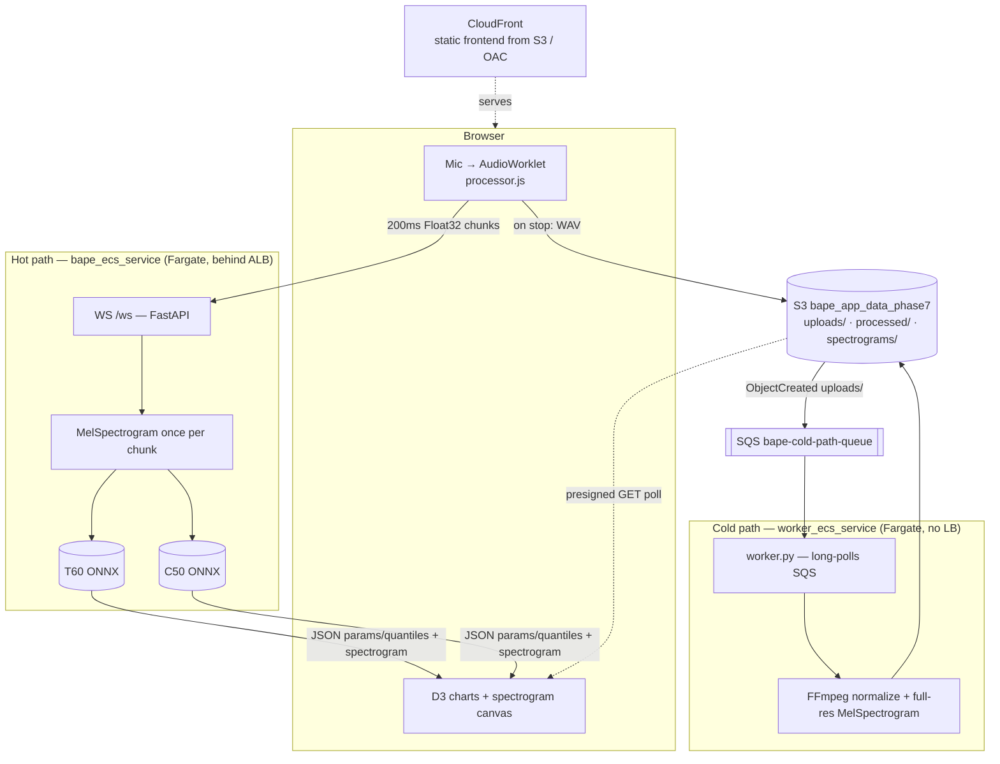

# Phase 7 — Distributed Hot-Path / Cold-Path Inference

> Real-time streaming inference decoupled from heavy asynchronous processing, so one workload can never starve the other.

The current, active phase. It splits the single real-time service from [Phase 6](../phase-6-production-ready) into two independently-scaled workloads on **ECS Fargate**:

- a **hot path** — latency-sensitive, real-time inference streamed over WebSockets, and
- a **cold path** — latency-insensitive, full-recording processing driven asynchronously through SQS.

The design goal: a CPU spike from processing a full recording must never introduce latency or drop a live connection. So the two paths run as separate Fargate services from the same image, and communicate only through S3 and a queue.

## Architecture



## Hot path

Browser mic audio is captured by an `AudioWorklet` ([`src/processor.js`](src/processor.js)), buffered into 200 ms / 3200-sample chunks, and streamed as raw binary `Float32Array` over the WebSocket. The server ([`app/main.py`](app/main.py) `WS /ws`) keeps a rolling **4 s (64000-sample) window**, computes a `MelSpectrogram` once per chunk (T60 and C50 share identical inputs), and runs both ONNX models **concurrently** (`asyncio.to_thread` + `asyncio.gather`) to stay under the 200 ms stride budget. It streams back JSON (params / quantiles / latents for both models, the newest spectrogram frames, and `inference_time_ms`). Measured inference is ~30–60 ms per stride after warmup.

## Cold path

On mic stop, the browser encodes the full recording to WAV client-side, fetches presigned URLs from `GET /api/presigned-urls`, and `PUT`s the WAV directly to S3 (`uploads/` prefix) — bypassing the API server entirely. An S3 `ObjectCreated` notification (filtered to `uploads/` to avoid a processing loop) enqueues to SQS. The worker ([`app/worker.py`](app/worker.py)) long-polls the queue, downloads the WAV, normalizes it with FFmpeg, regenerates a full-resolution spectrogram, uploads results to `processed/` / `spectrograms/`, and only then deletes the SQS message. The browser polls the presigned download URL (exponential backoff) until the results are ready.

## Key engineering decisions

- **Separate ONNX models for T60 and C50**, run concurrently rather than as one sequential monolith — each estimator can be re-exported or re-weighted independently.
- **Training / inference dependency split** — the production image ships only `onnxruntime` + `fastapi` (~150 MB); PyTorch, Hydra and the training codebase live in a dev-only pipeline and never enter the container.
- **Split Terraform state** — [`terraform/persistent/`](terraform/persistent) (S3, ECR, SQS, IAM, CI/CD OIDC) and [`terraform/compute/`](terraform/compute) (VPC, ECS, ALB, CloudFront) are independent root modules, so the cost-driving compute layer can be destroyed and re-applied without touching persistent state.
- **No NAT Gateway** — private subnets reach AWS services through VPC interface/gateway endpoints (S3, ECR, CloudWatch Logs, SQS) to avoid NAT cost.
- **Privacy by design** — a 1-day S3 lifecycle expiry and in-RAM processing; deliberate minimum data retention.
- **Numerical-parity CI discipline** — the ONNX exporter self-tests against reference PyTorch outputs (`.pth`) before export.

## Known open issue

The hot and cold paths compute spectrograms via genuinely different code paths (`processor.js` + numpy vs. FFmpeg + `MelSpectrogram`), which introduces measurable numeric drift. Refactoring the worker to replicate the hot path's 4-second sliding local standardization reduced feature drift from an MSE of ~1.5 to **~0.015**. [`scripts/compare_pipelines.py`](scripts/compare_pipelines.py) and the `spec_hot_*` / `spec_cold_*` dumps exist to keep quantifying it.

## Run locally

```bash
cd phase-7
python -m app.main          # uvicorn; host/port from UVICORN_HOST/UVICORN_PORT (default 127.0.0.1:8000)
python -m app.worker        # cold-path worker (separate process; long-polls SQS)
```

ONNX export (Hydra-driven; runs a parity self-test before exporting):

```bash
python scripts/param_estimator-onnx_exporter.py
```

## Layout

```
phase-7/
├── app/            FastAPI hot path (main.py), cold-path worker (worker.py), inference_engine.py
├── src/            Frontend — index.html, app.js, processor.js (AudioWorklet)
├── scripts/        ONNX exporter, compare_pipelines.py, bape_local (submodule)
├── conf/           Hydra config for the exporter
├── terraform/      persistent/ + compute/ (two independent root modules)
└── Dockerfile      Single image; hot and cold services differ only by task command
```
